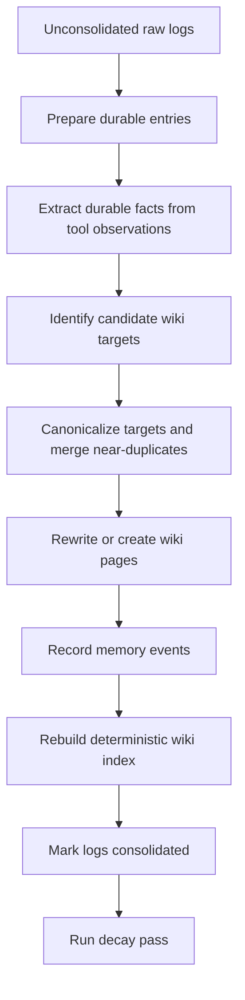

# Mycelium Design and Internals

This document describes how Mycelium is organized and how information moves through the system. For installation and day-to-day use, start with the [README](README.md).

## System overview

Mycelium is made of three primary layers:

- A Python memory library that handles retrieval, episodic encoding, consolidation, reconsolidation, and decay
- A FastAPI backend that owns persistent chat sessions and schedules background memory work
- A React web UI for chat, memory inspection, editing, and meeting ingestion

Ollama provides the local language-model runtime. The core agent memory is composed of Markdown and JSON files rather than an opaque database; the optional Engram pipeline uses SQLite for meeting-processing state.

## Project structure

```text
mycelium/
├── engram/             # Meeting upload, transcription, diarization, and ingestion
├── mycelium/           # Core memory library
│   ├── core.py         # Facade, retrieval, sessions, and dream entry point
│   ├── encoder.py      # Transcript-to-log persistence
│   ├── dream.py        # Log-to-wiki consolidation
│   ├── reconsolidation.py
│   ├── decay.py
│   ├── ollama.py       # Adapter around the official Ollama SDK
│   ├── prompts.py
│   ├── store.py        # Markdown wiki and log persistence
│   └── structured_outputs.py
├── server/             # FastAPI backend
│   ├── main.py         # App setup and background scheduler
│   └── api/            # Session, memory, and Engram routes
├── ui/                 # React frontend (Vite, TypeScript, and Tailwind)
├── tests/              # Python test suite
├── examples/           # Direct library integrations
├── benchmarks/         # LoCoMo and MemoryAgentBench harness
├── scripts/            # Benchmark and networking helpers
├── mycelium.toml       # Runtime configuration
├── start.sh            # Backend/frontend development launcher
└── pyproject.toml      # Python package and uv configuration
```

## Memory lifecycle

### 1. Chat and retrieval

When a user sends a message, the backend builds a retrieval query from the chat title, recent thread context, and current message. A routing LLM selects relevant wiki pages from the index. The routing context includes confidence, importance, retrievability, review time, recall sections, and source-log references so fresh, stable memories can be preferred without making older relevant pages unreachable.

Loaded pages are placed in the chat system prompt along with compact snippets from their backlinked raw logs. The entire current session transcript is then passed to the chat model.

After the response, a small structured LLM call determines which loaded pages materially contributed to the answer. Pages judged as used receive a reinforcement event, which increases stability and resets retrievability.

### 2. Tool observations

The chat model can call Ollama `web_search` and `web_fetch`. Tool calls are:

- Executed by the internal Ollama adapter
- Displayed in the UI with expandable arguments and results
- Stored on the assistant message in session history
- Written immediately as separate raw log entries, using the truncated result that was supplied to the model

Tool logs remain raw observations. They bypass conversational episode encoding, and a later dream pass decides whether they contain durable information.

### 3. Episode encoding

Each web chat keeps an active episode buffer. An episode is flushed:

- Manually through **Flush Current** or **Flush All**
- Automatically when it has been idle or has grown large
- On backend shutdown with a forced flush

The encoder writes the complete conversation episode into a durable raw log. This preserves the canonical source evidence instead of using an initial lossy fact-extraction pass.

Encoded episode IDs are tracked in `mycelium_store/sessions_meta.json`, preventing an already-flushed episode from being encoded repeatedly unless the memory store is cleared.

### 4. Dream consolidation

The dream process converts durable raw logs into semantic wiki pages:



Important behavior:

- Tool observations go through a source-grounded extraction prompt that discards navigation text, page furniture, rankings, and boilerplate.
- Target identification is batched by log entries, while canonicalization sees proposed targets from the entire dream pass. This reduces same-pass near-duplicates.
- Under the default `override` policy, each final canonical target is rewritten once. The `fork` and `merge` policies may require additional calls for existing pages.
- Session-only or ephemeral entries are marked consolidated without becoming wiki pages.
- `_index.md` is rebuilt deterministically from existing pages rather than being generated by the LLM.
- Cross-page references use Obsidian-style `[[page-slug]]` links; source references use `[[log:<entry-id>]]`.

### 5. Reconsolidation

When a page is loaded into a chat, a prediction-error check can flag it as labile if the new context suggests it is outdated, incomplete, or contradicted. Signals accumulate for the active episode and are resolved either manually or when the episode is flushed.

### 6. Memory state and decay

Wiki pages use event-driven memory state rather than a single decay score:

- `retrievability` is recomputed as `exp(-elapsed_days / stability_days)`.
- `stability_days` grows when a page is retrieved, used, dream-updated, or manually edited.
- `difficulty` increases with contradictions and falls with reinforcement.
- Creation, access, and review timestamps—as well as reinforcement and conflict counts—are stored in page frontmatter.
- Pinned pages are protected from archival.

A decay pass refreshes retrievability and archives only pages that are simultaneously low in retrievability, importance, and confidence; unpinned; and not recently accessed. Raw logs retain a simpler `decay_score` for log-level bookkeeping.

## Web sessions and direct library sessions

The web app owns long-lived session transcripts and scheduled episode flushing in `server/runtime.py`. Ordinary chat content is logged when an episode is flushed, while tool observations are logged immediately.

The direct Python API uses the `Mycelium.session()` async context manager. It retrieves pages on entry, encodes recorded messages on exit, resolves labile pages, and—under its default schedule—runs dream consolidation. This behavior is convenient for short agent runs but intentionally differs from the persistent web session model.

## Background automation

The FastAPI backend starts an APScheduler instance with these jobs:

- Every 5 minutes: flush episodes that are idle or have reached the turn limit
- Every 30 minutes: run dream consolidation
- At the configured decay interval: refresh memory state and archive weak pages
- On shutdown: force-flush active episodes

The web UI can trigger the same operations manually.

## Storage layout

The default store is `./mycelium_store`:

```text
mycelium_store/
├── sessions_meta.json  # Chats, transcripts, active episodes, and flush markers
├── logs/               # Daily raw episodic logs
├── wiki/               # Semantic memory pages and _index.md
│   └── _archive/       # Archived wiki pages
├── labile/             # Pending reconsolidation drafts and signals
└── engram/             # SQLite meeting metadata and uploaded audio
```

The files are deliberately readable and editable. Normal wiki edits should go through the UI or API so version metadata and update logs remain consistent.

## Configuration

Runtime settings live in `mycelium.toml`:

```toml
[store]
path = "./mycelium_store"
git_commits = false

[llm]
model = "gemma4:12b"
url = "http://localhost:11434"
temperature = 0.2
context_window_tokens = 32768

[session]
context_budget_tokens = 32768

[engram.whisper]
model = "large-v3"
device = "auto"
compute_type = "auto"
batch_size = 8
```

`llm.context_window_tokens` controls token-aware ingestion batching. It is separate from `session.context_budget_tokens`, which limits how much retrieved memory is loaded into a chat. Defaults for dream, reconsolidation, and decay are defined in `mycelium/config.py` when they are not present in the TOML file.

## Engram meeting pipeline

Engram stores uploaded meeting audio before processing it. The UI then starts an explicit processing workflow:

1. `faster-whisper` produces a timestamped transcript.
2. WhisperX aligns the transcript and pyannote assigns speaker labels.
3. The user reviews and can edit the transcript and speaker names.
4. Ollama generates a structured meeting summary.
5. The finalized meeting is ingested into the normal raw log store as a durable, unconsolidated entry.

Install the optional dependencies with:

```bash
uv sync --group engram
```

If the speech stack has resolution problems with Python 3.13, create the environment with Python 3.11:

```bash
uv python install 3.11
uv sync --python 3.11 --group engram
```

By default, `device = "auto"` and `compute_type = "auto"` select CUDA/`float16` when a CUDA-visible NVIDIA GPU is available, and CPU/`int8` otherwise. The path can be forced in `mycelium.toml`:

```toml
[engram.whisper]
device = "cuda"
compute_type = "float16"
```

Diarization requires accepting the terms for `pyannote/speaker-diarization-community-1` and exporting a Hugging Face token:

```bash
export HF_TOKEN=your_hugging_face_token
```

Uploaded recordings are copied to `mycelium_store/engram/audio/`. They initially appear as `ready`, move to transcript review after processing, and enter memory only after finalization.

### AMI smoke tests

With the AMI meeting subset available under `AMI/`, the slow transcription comparison can be enabled explicitly:

```bash
ENGRAM_RUN_AMI_TRANSCRIPTION=1 uv run pytest tests/test_engram_transcribe_ami.py
```

Optional overrides include:

```bash
ENGRAM_AMI_MEETINGS=ES2002a \
ENGRAM_AMI_WHISPER_MODEL=base.en \
ENGRAM_AMI_OUTPUT_DIR=test_outputs/ami_transcripts \
ENGRAM_RUN_AMI_TRANSCRIPTION=1 \
uv run pytest tests/test_engram_transcribe_ami.py
```

The test writes `*.whisper.txt`, `*.reference.txt`, and `*.segments.json` for manual comparison. A five-minute WhisperX/pyannote diarization comparison can be run with:

```bash
HF_TOKEN=your_hugging_face_token \
ENGRAM_RUN_AMI_DIARIZATION=1 \
ENGRAM_AMI_DIARIZATION_MEETING=ES2002a \
ENGRAM_AMI_WHISPER_MODEL=base.en \
uv run pytest tests/test_engram_transcribe_ami.py::test_diarize_ami_first_five_minutes_with_whisperx_for_manual_comparison -s
```

Add `ENGRAM_AMI_WHISPER_DEVICE=cpu ENGRAM_AMI_WHISPER_COMPUTE_TYPE=int8` to force CPU inference. The diarization test writes diarized text, segment data, reference words, and metrics under `test_outputs/ami_transcripts/`.

## Remote access and WSL

The frontend derives its backend origin from the hostname used to load the page. For example, loading `http://192.168.x.x:5173` makes API requests to `http://192.168.x.x:8000/api`. Override that behavior with `VITE_API_ORIGIN`:

```bash
cd ui
VITE_API_ORIGIN=http://localhost:8000 npm run dev
```

Keep Ollama bound to localhost; only the backend needs to communicate with it.

For WSL on Windows, mirrored networking lets other trusted LAN or Tailscale devices reach the WSL development servers. Add the following to `C:\Users\<you>\.wslconfig`:

```ini
[wsl2]
networkingMode=mirrored
```

Restart WSL from PowerShell with `wsl --shutdown`, restart Mycelium, then connect to `http://<windows-lan-or-tailscale-ip>:5173`.

If mirrored networking is unavailable, the repository includes a port-proxy helper. Run it from an Administrator WSL terminal:

```bash
powershell.exe -ExecutionPolicy Bypass -File "$(wslpath -w scripts/Expose-MyceliumWsl.ps1)" -SetPrivateNetwork
```

## Benchmarks

The benchmark harness compares Mycelium with a no-memory baseline and a full-context baseline. Keep benchmark repositories adjacent to this repository:

```text
/home/user/Development/
├── mycelium/
├── locomo/
└── MemoryAgentBench/
```

Run a small LoCoMo smoke benchmark:

```bash
uv run python -m benchmarks.mycelium_bench locomo \
  --locomo-path ../locomo/data/locomo10.json \
  --system mycelium \
  --qa-model gemma4:12b \
  --memory-model gemma4:12b \
  --max-samples 1 \
  --max-questions 3
```

Quickly run the second LoCoMo conversation with `scripts/benchmark-locomo-convo2.sh`. Change `--system` to `null` for no persistent memory or `full_context` for the full-context baseline.

For a MemoryAgentBench smoke run:

```bash
uv run python -m benchmarks.mycelium_bench mab \
  --mab-root ../MemoryAgentBench \
  --dataset-config ../MemoryAgentBench/configs/data_conf/Accurate_Retrieval/EventQA/Eventqa_64k.yaml \
  --system mycelium \
  --qa-model gemma4:12b \
  --memory-model gemma4:12b \
  --max-contexts 1 \
  --max-queries 3
```

Full-suite helpers are available as:

```bash
scripts/benchmark-locomo-full.sh
scripts/benchmark-memoryagentbench-full.sh
scripts/benchmark-all-full.sh
```

They accept environment overrides such as:

```bash
QA_MODEL=llama3.1:8b MEMORY_MODEL=gemma4:12b RUN_TAG=after-decay-tuning scripts/benchmark-all-full.sh
```

Full runs default to `DREAM_POLICY=per-case`; this can be changed, for example, with `DREAM_POLICY=per-batch scripts/benchmark-locomo-full.sh mycelium`. Results are written beneath `benchmark_runs/<run-id>/` as predictions, JSONL rows, and summaries. MemoryAgentBench may require its own dependencies and Hugging Face dataset downloads.

## Development

Run the backend tests:

```bash
uv run pytest
```

Build the frontend:

```bash
cd ui
npm run build
```

The UI renders Markdown, GitHub-flavored tables and lists, and KaTeX notation.

Current implementation notes:

- Git commit integration exists in configuration and model fields but is not a primary UI workflow.
- The backend allows broad CORS access for local development and should be tightened before deployment.
- The combined `start.sh` launcher is intended for development; the backend can also be started independently with `uv run python -m server.main`.
