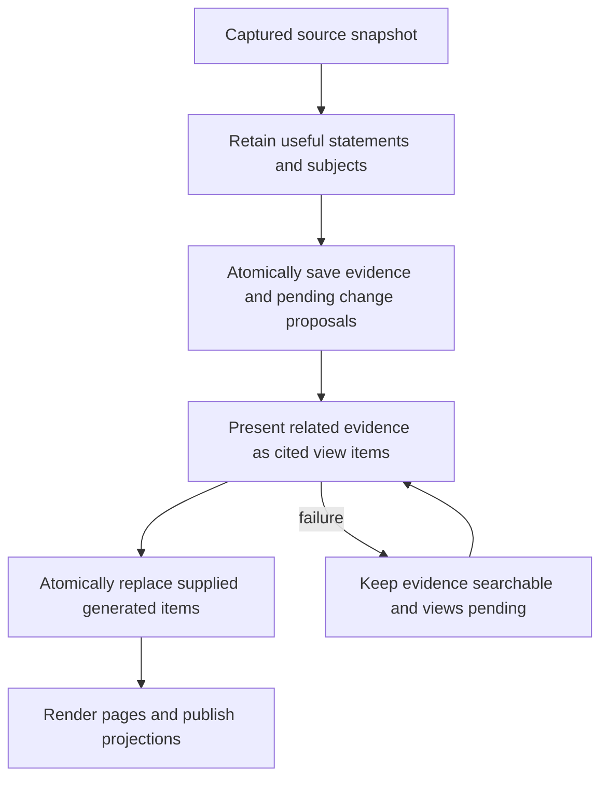

# Mycelium Design and Internals

This document describes how Mycelium is organized and how information moves through the system. For installation and day-to-day use, start with the [README](README.md).

## System overview

Build Memory uses two semantic passes for a small source: retain useful evidence, then organize cited views.
Retention returns subjects, statements with exact source-segment citations, and proposed changes to prior memory.
Presentation selects and groups statements under natural headings with page destinations.
Generated items display the selected retained text; presentation does not paraphrase it again.
One statement can support several distinct items or pages. Claims retain their evidence independently of views.

The model selects useful context rather than accounting for every sentence. Unselected text remains in the
original source. Code validates exact IDs and structural invariants, never repairs meaning with keyword rules.
Completed retention batches survive a later view failure. Capture, reference validation, persistence, page
rendering, and source retraction do not require semantic model stages of their own.

Mycelium is made of three primary layers:

- A Python memory library that handles retrieval, source-grounded encoding, consolidation, and claim-level reconsolidation
- A FastAPI backend that owns persistent chat sessions and explicit memory operations
- A React web UI for chat, memory inspection, reconciliation review, and meeting ingestion

Ollama provides the local language-model runtime. Core memory and chat state use a canonical SQLite database with inspectable JSON records and Markdown projections; Engram keeps its separate meeting-processing database.

## Project structure

```text
mycelium/
├── engram/             # Meeting upload, transcription, diarization, and ingestion
├── mycelium/           # Core memory library
│   ├── core.py         # Composition root and public Mycelium facade
│   ├── pipeline.py     # Authoritative high-level memory lifecycle
│   ├── operations.py   # Typed lifecycle inputs and outputs
│   ├── retrieval.py    # Read-only memory retrieval orchestration
│   ├── claim_index.py  # Rebuildable LanceDB hybrid claim index
│   ├── retrieval_context.py # Canonical evidence construction and refresh
│   ├── evidence_budget.py # Pure fitting of complete records and source segments
│   ├── evidence_rendering.py # Shared evidence/workspace/tool text rendering
│   ├── encoder.py      # Durable capture and source segmentation
│   ├── retention.py    # Bounded source-to-evidence retention and recovery
│   ├── memory_contract.py # Two flat structured model contracts
│   ├── memory_inputs.py # Typed payloads, cited claim context, and request-local IDs
│   ├── views.py        # Cited view refresh with concurrent-edit protection
│   ├── dream.py        # Build orchestration, checkpoints, and status
│   ├── reconsolidation.py # Evidence-triggered proposal analysis and review
│   ├── materialization.py # Deterministic claim-to-wiki projection
│   ├── ollama.py       # Adapter around the official Ollama SDK
│   ├── prompts.py
│   ├── store.py        # Markdown wiki and log persistence
│   └── structured_outputs.py
├── server/             # FastAPI backend
│   ├── main.py         # App setup and API router registration
│   └── api/            # Session, memory, and Engram routes
├── ui/                 # React frontend (Vite, TypeScript, and Tailwind)
├── tests/              # Python test suite
├── examples/           # Direct library integrations
├── benchmarks/         # LoCoMo and MemoryAgentBench harness
├── scripts/            # Benchmark and networking helpers
├── mycelium.toml       # Runtime configuration
├── start.sh            # Backend/frontend development launcher
└── pyproject.toml      # Python package and uv configuration
```

## Reading and changing the pipeline

Start with `core.py` for composition and `pipeline.py` for the public lifecycle.
The orchestration methods name the stages and keep data writes and recovery visible:

| Concern | Entry point | Responsibility |
| --- | --- | --- |
| Build coordination | `ConsolidationProcess.run` in `dream.py` | Find pending episodes, group conversation context, retain sources, refresh views, and finalize the audit. |
| Retention and recovery | `Retainer.retain_sources` in `retention.py` | Plan bounded batches; prepare retention input; save retained memories and per-source checkpoints. |
| Page organization | `ViewOrganizer.refresh_views` in `views.py` | Prepare writable memories and context, request view items, validate the read snapshot, and save items. |
| Initial retrieval | `MemoryRetriever.retrieve` in `retrieval.py` | Prepare the search query, select evidence against a snapshot, and construct the result. |
| Canonical evidence | `RetrievedContextBuilder` in `retrieval_context.py` | Read current claims, views, identities, and cited sources; refresh previously displayed evidence. |
| Representation | `memory_inputs.py`, `evidence_budget.py`, `evidence_rendering.py` | Compact model references, fit complete evidence, and render shared text. |

`RetentionInput`, `RetentionResult`, `PresentationInput`, and `PresentationResult`
describe existing dictionaries for readers and type checkers. They add no fields
to model requests. The dynamic schemas in `memory_contract.py` remain responsible
for validating decisions against the exact IDs supplied in each request.

### Ownership and consistency

- Capture stores source text and episode manifests. Build owns extraction and view creation.
- Retention reads through a `UnitOfWork` snapshot while the model runs, then
  validates those reads inside the transaction that saves claims and checkpoints.
  Failed attempts merge into current checkpoint state; they cannot fail a newer completion.
- View refresh reuses a lifecycle service's snapshot when one already exists.
  Otherwise it owns one. Its commit preserves protected items and user edits.
- Retrieval validates its snapshot after model selection. It permits one repeat
  when a concurrent edit invalidates that snapshot; result construction contains
  no further await. Later source reads refresh current evidence independently.
- SQLite holds canonical records. Wiki materialization and the search index are
  derived views; rendering and budget helpers do not persist artifacts.

The model client and curation services already have separate named operations.
Keep changes close to those operations; file size alone is not a reason to add
another service layer. For a behavior-preserving refactor, compare frozen model
requests and stored records in addition to running the regression suite.

## Memory lifecycle

The authoritative library entry point is `MemoryPipeline`, composed by `Mycelium`. Its operations have explicit
contracts:

```text
SourceInput          -> ingest_source()    -> IngestionResult
RetrievalRequest     -> retrieve_context() -> RetrievalResult
ConsolidationRequest -> consolidate()      -> ConsolidationResult
```

The FastAPI server, Engram, benchmarks, examples, and direct Python integrations all use these same operations.
Lower layers implement one concern each: `Encoder` persists sources, `Retainer` extracts claims, `MemoryRetriever` selects
read-only assistant context, `ConsolidationProcess` coordinates semantic consolidation, and repository/materializer
classes persist canonical artifacts and generated views.

### 1. Chat and retrieval

When a user sends a message, the backend builds a retrieval query from the chat title, recent thread context,
and current message. A local LanceDB projection performs hybrid vector and full-text search over active canonical
and short-term claims. EmbeddingGemma supplies normalized semantic embeddings through Ollama. The index is derived
state: it is synchronized from canonical SQLite claim records and can be deleted and rebuilt without losing memory.

Hybrid similarity only proposes candidates. Canonical claims remain independently selectable; related views
are optional records sharing their supporting claims. One structured model decision orders complementary record
IDs and reports supported aspects and remaining gaps. Selection receives shared records and exact cited sources
once, as compact JSON with reversible request-local references. Human text, identity roles, times, reviews and
citation links retain their meaning. Answering receives the selected original records and their cited sources,
so a detail preserved only in a source can make its record useful to the request.
Complete records are fitted in candidate order, with canonical matches before optional views. Sources fit as
whole transcript segments. Omitted evidence is marked; candidates outside the request budget cannot be selected.
An empty fitting set returns an explicit budget error. There is no chunk-selection/merge cascade.
Admission reads a canonical snapshot and reselects once if consulted state changes during inference; a repeated
conflict or broken citation produces a typed error. Admitted order forms a small initial evidence result. The stable system prompt contains only the
assistant's behavior contract; the current request carries runtime-supplied evidence as a separate structured
Markdown/pseudo-XML workspace. The assistant can then call `memory_search` with focused follow-up queries when a
requested person, event,
relation, or time is still unsupported, and can call `memory_sources` for the exact dialogue behind any claim already
shown during that response. Search count, result count, and cumulative evidence tokens are bounded per response;
subsequent searches omit claims already returned.

The workspace is transient state owned by the runtime, not a model-managed notebook. Each successful memory operation
merges complete typed records or sources by ID and revision and appends an inspectable operation entry. Source text,
citations and interpretation status refresh after successful and failed tools. Refresh updates only source segments
and citation links already inspected; explicit source reads discover additional excerpts and spend only their new evidence allowance.
Newer revisions replace obsolete
evidence; equal revisions merge exact citations. Eight recent operations are retained, and model-facing diagnostics
fit the whole workspace budget. The newest memory
tool message contains the one complete current workspace; the initial workspace is removed from the request and older
full workspace messages become compact supersession receipts. Assistant reasoning and tool calls remain in the
chronological message history. This prevents duplicate evidence from accumulating while preserving the evidence found
across a multi-step traversal. The final workspace is stored on the assistant transcript entry and can be inspected in
the chat UI.

Canonical claims are represented directly, including when a larger related view does not fit. Views can also be
selected as complete records. Initial evidence and tool results share one schema containing explicit subjects, statements, claim IDs,
normalized timing, and source citations. Initial retrieval and follow-up search include the exact cited lines that
fit after their complete interpretation records. The assistant can use `memory_sources` with supporting claim IDs
to expand the bounded structural conversation neighborhood. The transcript remains
chronological, with cited lines marked in place. Retrieval traces preserve candidate rank, hybrid score, admission
decision, selected record and claim IDs, and the claims that fit in the final budget. Search result limits count
actual records. Refresh preserves selected view membership; if a view loses valid support, the surviving canonical
claim states replace it so old source wording cannot silently revive a superseded interpretation.

Direct claim records include their existing active entity bindings, canonical names, aliases and exact roles,
even before a wiki page exists. Multiple bindings remain distinct; a context participant is not made an owner.
Reference and identity-review revisions invalidate accumulated evidence. Real page links include the assigned
identities that have materialized pages. Identity metadata is not yet included in search indexing: the tested
projection changed ranking unfavorably and remains outside production.

Retrieval is read-only. It never reinforces, destabilizes, or rewrites a page.

Typed evidence is also the budgeted retrieval unit: complete records are fitted against their actual rendered
envelope, and chat fits those same records against the complete prompt using the shared token estimator.
Source excerpts retain whole segments, source status and exact claim links, including when only part of a source
fits the final prompt. Repeated source reads advance through unseen segments. Omitted evidence sets `more_available`.
Uncited neighboring dialogue requires a retained cited anchor and is expanded only on request.
Synthetic `WikiPage` objects no longer participate in retrieval
or chat admission. `RetrievalResult.page_references` and `Session.page_references` contain only navigation metadata
for real wiki pages associated with admitted evidence. Chat's `loaded_pages` metadata describes those references
after prompt fitting, not page bodies supplied to the model. Unowned claims do not require a page to be admitted.
Budgets too small even for the empty evidence envelope raise an explicit error.

### 2. Assistant tools

The chat model can call the read-only `memory_search` and `memory_sources` tools alongside Ollama `web_search` and
`web_fetch`. All tool calls are displayed in the UI and stored on the assistant message. Web results are external
observations and are captured immediately as sources; their extraction waits for Build Memory. Memory-tool results are reads
of existing evidence and are not re-ingested as new memories.

Memory results use one Markdown/pseudo-XML renderer. Search records put their statement and subject before supporting
IDs and citations. Source results explicitly map each claim to its cited segment IDs, then present the surrounding
transcript in chronological order. Tools bound their own output by admitting only complete records and segments; the
agent runtime never slices a serialized tool result. Persisted tool events retain the incremental raw result for
auditing, while the model receives the full current workspace after each memory operation.

Retention receives source kind and speaker roles, so tool observations and assistant suggestions remain
attributable to their actual sources rather than becoming implicit user commitments.

### 3. Automatic source capture and explicit extraction

Each completed web chat turn is persisted in the session transcript, then captured as a source with stable
idempotency keys, exact segment timestamps, and speaker roles. A captured-turn cursor advances only after the
turn and its non-memory tool observations are saved. If capture fails, the reply remains saved, the UI reports
pending capture, and the next turn or Build Memory retries. There is no duplicate active-episode buffer.

Capture writes a raw log, SourceDocument, EpisodeManifest, and IngestionOperation without model calls or indexing.
Library ingest_source has the same capture-only contract. Reviewed meeting transcripts are admitted before optional
summary generation; a failed summary is retryable without recapturing or reopening the retained source for edits.

Build Memory snapshots source IDs and processes unfinished retention and presentation for that snapshot.
New sources remain pending. A store-wide mutation lock serializes Build and lifecycle edits; web capture recovery
uses per-session locks before the snapshot. Whole source segments form bounded retention batches, and oversized
turns are split without changing their text. Batch results and completion checkpoints commit together.
A failed or cancelled batch stays retryable; no-op Builds make no model calls.

Web turn sources can point to preceding turns for interpretation. Retention includes bounded original context
segments and their exact IDs. Each new statement must cite at least one new-source segment; it may also cite
context against its original source. Source roles, speakers, occurrence times, and segment timestamps survive
capture. The prompt preserves conditional and relative wording rather than inventing unsupported calendar dates.

Search discovers retained statements, including those without a page. Unbuilt transcripts stay inspectable but
are not searched as memory. Evidence supplied to agents warns when source extraction or view updates are pending.
This is a status warning, not a guarantee that an answer will mention every missing detail.

### 4. Build Memory organization



- `memory_contract.py` declares two flat responses. Retention selects subjects, statements, and changes;
  presentation selects items. Exact request-local subject, citation, change-target, and view IDs constrain
  structured generation. Persistence validates the same contract again. Unknown references are rejected.
- Learned claim retrieval interleaves per-chunk rankings into bounded prior context, so earlier chunks cannot
  exhaust the shortlist before later chunks are considered. There is no full identity-planning cascade, separate
  page-admission call, fixed heading ontology, truth-pair matrix, or per-item prose call. A new subject can receive
  a page from one useful conversation. Namesakes and uncertain identity matches remain model judgments with
  inspectable evidence and optional review.
- Admission rejects ineligible participant bindings before counting conflicts between eligible people.
  Relevant declared people and exact speaker bindings reach presentation as optional choices; speakers are
  not automatically subjects of the statements they supply, and no person or project page is mandatory.
- Retention does not deactivate earlier claims. Suggested supersessions or contradictions become pending human
  reviews. Both sides remain available. Existing items that cite pending evidence are protected during refresh.
- A view item owns its heading and destinations; a claim has no exclusive page or item membership. Different
  items can cite the same evidence. A linked destination intentionally displays that item's complete text.
  Generated text joins selected statements in the model's order, deduplicating exact repeated IDs within the
  item. Human text edits remain protected. Persistence skips new duplicates at the same exact support IDs,
  destination IDs and heading, including repeated representations of a protected item. Distinct destinations
  or headings and existing manual splits remain valid. This preserves qualifications at the cost of sometimes longer
  or repetitive pages; selection can still omit useful context or choose an imperfect heading/destination.
  Presentation can return no item for retained evidence; that evidence remains searchable as `deferred`.
- Refresh authorizes existing items through incoming subjects, exact changed claims, and support/endpoint
  links. Similarity alone supplies read-only context, which cannot become view support or authorize writing
  another subject's page. Selected shared items retain their complete support. It replaces only supplied,
  unprotected generated items. Other items and manually edited items survive. An optimistic database snapshot
  rejects publication if the inputs changed during the model call, preventing a concurrent manual edit from
  being overwritten. It does not silently repeat semantic work.
- Manual move/split/group operations edit views and preserve their source citations. Split groups may share
  evidence. Identity review binds exact reviewed evidence; choosing no page excludes only that evidence on that
  subject's page. Other useful evidence can still support a page. These decisions reopen pending view work even
  when extraction of the original source is complete.
- The deterministic materializer projects active, fully supported items with source footnotes, review markers,
  and natural headings. Distinct items sharing citations remain visible. Unsupported generated items disappear;
  manual records remain inspectable. Empty non-You pages disappear while subject records remain available.
  `_index.md` and the You map are rebuilt from current materialized pages.
- A failed view refresh preserves committed evidence and prior views, reports pending work, and retries only
  the unfinished work. Publication uses the SQLite outbox, so file recovery does not rerun models. Build audits
  record completion, failures, pending sources, and proposal IDs.
- Failed retention updates only its unchanged batch checkpoint and finalizes from current stored episodes.
  A competing completed batch and its claim membership survive optimistic conflicts.
- Work is bounded by source/claim batches and retrieved context. Expanding selected existing items to all their
  supporting claims can still produce an oversized request in an unusually dense store; it fails visibly rather
  than dropping citations. The two-call small-source path is not a promise of constant cost at every store size.

### 5. Corrections, retraction, and reconsolidation

A pending change proposal keeps both claims active. Approval or rejection updates exact canonical links/status
and refreshes affected views inside a staged lifecycle transaction. Presentation cannot resolve a truth review.
Failure rolls back the canonical and view change together; repeated identical submissions reuse the result.

A human correction preserves the exact submitted statement, obtains correction metadata, and retains its subject
references before refreshing affected views. Relative dates require an explicit saved date preview before the
correction applies. Retraction withdraws the selected source without a model call. Claims with surviving source
support remain active; claims without support become inactive, and all affected views regenerate. Manual items
remain inspectable even when their withdrawn support prevents them from appearing in a page.

## Web sessions and direct library sessions

The web app owns long-lived session transcripts and automatic completed-turn capture in `server/runtime.py`. Ordinary chat content and non-memory tool observations are saved as sources after the reply, without running extraction.

The direct Python API can call `retrieve_context`, `ingest_source`, and `consolidate` explicitly with typed contracts.
`Mycelium.session()` is an ergonomic conversational wrapper: it retrieves typed evidence and real wiki page references on entry and ingests recorded messages
on exit. Consolidation remains an explicit operation.

## Memory operations

The backend does not schedule memory builds. POST /api/memory/build captures any pending saved turns and invokes
the library's explicit consolidate operation. GET /api/memory/build/status exposes pending-source and statement
counts, not age or size readiness thresholds. Flush and run-if-ready endpoints have been removed.

The UI exposes Build Memory, source/claim inspection, view editing, identity and truth review, and development
resets. Source and segment timestamps are preserved. Ordinary retained statements keep relative wording and source
time rather than attaching model-guessed calendar precision. Schema 2 requires fresh stores.

Corrections use structured temporal metadata. Relative-date corrections create durable previews and require exact
reference choices before application. Calendar arithmetic resolves reviewed offsets/periods without interpreting
prose. Reviewed metadata, submission time, and citation provenance survive retries; fingerprints reject stale
drafts. Absolute/no-relative-time corrections apply directly. Internal Dream audit names remain storage vocabulary;
they do not imply that the retired semantic stages still execute.

## Architecture authority and validation

This document describes the intended current production architecture. Dated files under `planning/` are
historical design and audit records unless they explicitly say otherwise. When a production mechanism changes,
update this document and the user-facing README in the same change.

A memory milestone is complete only when its implementation checklist and declared acceptance conditions pass.
Use the following repository checks before checkpointing a change:

```bash
uv run ruff check mycelium server tests benchmarks
uv run pytest -q
cd ui && npm run lint && npm run build
git diff --check
```

Semantic milestones need a declared, bounded configured-model check and inspection of sources, evidence, views,
and answers. Unit tests with mocked outputs establish mechanics, not meaning. Benchmarks are guideposts: choose
acceptance around coherent, useful memory and practical local cost, not complete coverage or perfect organization.
Fix recurring misleading behavior and structural failures; record ordinary omissions without extending the run.

### Semantic LLM development workflow

Prompt, ontology, and model-labor changes follow a direct-first workflow:

1. State the product-level semantic invariant without referring to a benchmark example.
2. Call the configured host Ollama model directly with the real production prompt and structured schema. Use a
   small neutral case that isolates the decision, followed by a counterexample that could expose over-admission or
   false identity merging.
3. Integrate only the smallest mechanism that worked directly. Exact evidence aliases, schema values, and registry
   IDs belong in structured contracts; human-language meaning remains a model decision with cited evidence.
4. Run focused contract and pipeline tests, then exercise the integrated path with the real configured model.
5. Freeze inputs, configuration, limits, and comparison scope before a bounded check. Reuse frozen evidence when
   evaluating view or retrieval changes, and state limits when pipeline versions or completed work differ.
6. Record timeouts, transport errors, and malformed contracts separately from semantic mistakes. Do not treat an
   incomplete run as a successful comparison or extend its budget to chase a clean score.
7. Record direct probes, in-situ paths, cost, source review, validation, and residual failures in `DEVLOG.md`.
   Each extra stage, schema field, retry, or rule needs a concrete product benefit. End the tranche at its declared
   gate and move to product use; ordinary omissions and reasonable identity errors do not block all other work.

The host Ollama service is normally `http://localhost:11434`. Sandboxed agents must verify it through a read-only
`/api/tags` request with network escalation and use the same escalation for probes and benchmarks. They must not
start another server, change the configured URL, or substitute a fallback model to bypass sandbox isolation.

## Storage layout

The default store is `./mycelium_store`; the server accepts `MYCELIUM_STORE` for a
fresh alternative, and library/benchmark callers select their own store directory.

```text
mycelium_store/
├── memory.sqlite3      # Canonical artifacts, raw logs, chat summaries/messages, receipts and revisions
├── .writer.lock        # OS-backed ownership; not copied into snapshots
├── wiki/               # Generated Markdown pages and _index.md
│   └── _archive/       # Archived generated pages
├── logs/               # Generated daily raw-log views
├── indexes/lancedb/    # Rebuildable claim search projection
└── diagnostics/        # Model timing and optional request diagnostics
```

A shared process-local handle owns the SQLite connection and an OS-backed lock.
Other writer processes fail before accessing the store. SQLite uses WAL, foreign
keys, indexed record lookups, transactional revisions and a unique entity-slug index.
Ordinary operations and explicit close remain bound to the creating thread. Resource
collection can safely release a handle on another thread under the same lock that
protects transactions; it does not permit concurrent cross-thread database use.
Chat summaries are separate records from messages, so sidebar listing never loads
transcripts. Old JSON stores are rejected; this release has no migration backend.

Model-driven lifecycle edits use a consistent database read snapshot with an
isolated write set. Publication validates consulted record/collection revisions in
a short write transaction, preserving unrelated capture and rejecting actual conflicts.
No write transaction is held across model calls. Synchronous curation and ingestion
also commit atomically. Dream journals record plans and errors, but application rolls
back completely on failure; a failed plan cannot strand partially changed entities.

Intended Markdown content/deletions are committed with canonical changes in a durable,
ordered publication queue. Atomic file replacement is retryable without model work or
new page versions. The inspector exposes failures and retry. This provides recoverable
eventual Markdown publication, not a cross-filesystem/database atomic transaction.

Claim indexing uses database collection revisions and changed IDs, including claims
whose owner changed. Incremental lookups/deletions use batches of at most500 IDs;
unchanged search performs no artifact-directory scan. Index checkpoints advance only
after successful synchronization. Embedding revisions include the configured model's
actual weight digest; changed weights rebuild the derived index, including dimension
changes. Invalid vectors or weights changing during generation fail explicitly.
At 10,000 claims, an IVF_FLAT L2 index partitions storage into 100 groups and searches
all partitions; smaller stores bypass the index. Unindexed appends remain searchable.
This preserves exhaustive vector search while reducing measured local query overhead;
it does not establish semantic retrieval recall or end-to-end QA quality.

Snapshots use SQLite backup and reconstruct Markdown from the backed-up records;
they exclude locks and rebuildable indexes. `python -m mycelium.snapshots` exports
canonical JSONL records for inspection. Benchmarks, lifecycle services, and runtime
code use repositories rather than artifact-file paths. Engram storage remains separate.

## Configuration

Runtime settings live in `mycelium.toml`:

```toml
[llm]
model = "gemma4:12b"
url = "http://localhost:11434"
temperature = 1.0
context_window_tokens = 65536
reasoning_enabled = false

[session]
context_budget_tokens = 32768

[engram.whisper]
model = "large-v3"
device = "auto"
compute_type = "auto"
batch_size = 8
```

`llm.context_window_tokens` controls token-aware ingestion batching. It is separate from `session.context_budget_tokens`, which limits how much retrieved memory is loaded into chats. Dream projection defaults live in `mycelium/config.py`.

Explicit constructor/CLI overrides take precedence over a requested TOML file,
then dataclass defaults. Missing requested files and invalid values fail before
store creation. A `Mycelium` instance takes a copied, validated `Config` or a
`config_path`. Benchmark clients capture their settings once for all cases;
daily-driver trials share the same captured configuration. LoCoMo resume checks
compare full effective memory and QA settings, including URLs and sampling.

## Engram meeting pipeline

Engram stores uploaded meeting audio before processing it. The UI then starts an explicit processing workflow:

1. `faster-whisper` produces a timestamped transcript.
2. WhisperX aligns the transcript and pyannote assigns speaker labels.
3. The user reviews and can edit the transcript and speaker names.
4. Finalization freezes the transcript, speaker names and meeting metadata, then
   captures it as a durable source/log/episode through the normal memory API.
5. Ollama generates an optional structured summary, retained with the meeting.
   Summary failure does not undo source admission; retries reuse the saved source.

One operation owns a meeting at a time. Speech work also holds a device lock.
Cancellation waits for a native worker to finish before releasing that lock or
removing its audio file; queued jobs cancel immediately. Deletion waits for
in-flight source admission to finish its bookkeeping and skips subsequent summary
generation. Removing an Engram meeting does not retract memory already admitted.

Typed warning records distinguish diarization and summary failures from fatal
processing/admission errors. Successful retries resolve warnings while retaining
history. Interrupted diarization returns the existing transcript to review;
interrupted finalization keeps its durable edit lock and can retry unchanged.
SQLite foreign keys prevent late segment writes from orphaning deleted meetings.

Speech processing is part of the standard project dependencies. Install it with
the rest of the application:

```bash
uv sync
```

By default, `device = "auto"` and `compute_type = "auto"` select CUDA/`float16` when a CUDA-visible NVIDIA GPU is available, and CPU/`int8` otherwise. The path can be forced in `mycelium.toml`:

```toml
[engram.whisper]
device = "cuda"
compute_type = "float16"
```

Diarization requires accepting the terms for `pyannote/speaker-diarization-community-1` and exporting a Hugging Face token:

```bash
export HF_TOKEN=your_hugging_face_token
```

Uploaded recordings are copied to `mycelium_store/engram/audio/`. They initially appear as `ready`, move to transcript review after processing, and enter memory only after finalization.

### AMI smoke tests

With the AMI meeting subset available under `AMI/`, the slow transcription comparison can be enabled explicitly:

```bash
ENGRAM_RUN_AMI_TRANSCRIPTION=1 uv run pytest tests/test_engram_transcribe_ami.py
```

Optional overrides include:

```bash
ENGRAM_AMI_MEETINGS=ES2002a \
ENGRAM_AMI_WHISPER_MODEL=base.en \
ENGRAM_AMI_OUTPUT_DIR=test_outputs/ami_transcripts \
ENGRAM_RUN_AMI_TRANSCRIPTION=1 \
uv run pytest tests/test_engram_transcribe_ami.py
```

The test writes `*.whisper.txt`, `*.reference.txt`, and `*.segments.json` for manual comparison. A five-minute WhisperX/pyannote diarization comparison can be run with:

```bash
HF_TOKEN=your_hugging_face_token \
ENGRAM_RUN_AMI_DIARIZATION=1 \
ENGRAM_AMI_DIARIZATION_MEETING=ES2002a \
ENGRAM_AMI_WHISPER_MODEL=base.en \
uv run pytest tests/test_engram_transcribe_ami.py::test_diarize_ami_first_five_minutes_with_whisperx_for_manual_comparison -s
```

Add `ENGRAM_AMI_WHISPER_DEVICE=cpu ENGRAM_AMI_WHISPER_COMPUTE_TYPE=int8` to force CPU inference. The diarization test writes diarized text, segment data, reference words, and metrics under `test_outputs/ami_transcripts/`.

## Remote access and WSL

The frontend derives its backend origin from the hostname used to load the page. For example, loading `http://192.168.x.x:5173` makes API requests to `http://192.168.x.x:8000/api`. Override that behavior with `VITE_API_ORIGIN`:

```bash
cd ui
VITE_API_ORIGIN=http://localhost:8000 npm run dev
```

Keep Ollama bound to localhost; only the backend needs to communicate with it.

For WSL on Windows, mirrored networking lets other trusted LAN or Tailscale devices reach the WSL development servers. Add the following to `C:\Users\<you>\.wslconfig`:

```ini
[wsl2]
networkingMode=mirrored
```

Restart WSL from PowerShell with `wsl --shutdown`, restart Mycelium, then connect to `http://<windows-lan-or-tailscale-ip>:5173`.

If mirrored networking is unavailable, the repository includes a port-proxy helper. Run it from an Administrator WSL terminal:

```bash
powershell.exe -ExecutionPolicy Bypass -File "$(wslpath -w scripts/Expose-MyceliumWsl.ps1)" -SetPrivateNetwork
```

## Benchmarks

The benchmark harness compares Mycelium with a no-memory baseline and a full-context baseline. Keep benchmark repositories adjacent to this repository:

```text
/home/user/Development/
├── mycelium/
├── locomo/
└── MemoryAgentBench/
```

Run a small LoCoMo smoke benchmark:

```bash
uv run python -m benchmarks locomo \
  --locomo-path ../locomo/data/locomo10.json \
  --system mycelium \
  --qa-model gemma4:12b \
  --memory-model gemma4:12b \
  --max-samples 1 \
  --max-questions 3
```

Run a selected LoCoMo conversation directly from the repository root:

```bash
.venv/bin/python -m benchmarks locomo \
  --config-path mycelium.toml \
  --qa-model gemma4:12b --memory-model gemma4:12b \
  --sample-index 2 --snapshot-sessions
```

The module generates a timestamped run ID automatically; pass `--run-id <name>` for a custom name.
Change the 1-based sample index as needed, or pass `--system null` or `--system full_context`
to run those baselines. Omitting the sample index runs all samples unless limited by `--max-samples`.

For a human-reviewed encoding/wiki baseline (no QA scoring), use a fresh run ID:

```bash
.venv/bin/python -m benchmarks locomo \
  --wiki-baseline --sample-index 1 --max-sessions 2 \
  --config-path mycelium.toml --qa-model gemma4:12b \
  --run-id locomo-wiki-before-external
```

Repeat with `--user-speaker Caroline --run-id locomo-wiki-before-user` to explicitly bind that exact speaker
to the configured user; names/dialogue remain unchanged. Without this flag both speakers are external participants.
This mode seeds the default You identity, captures each session through the current public API, and runs Build
Memory after each session. It rejects reused output directories and derived-store replay options.

Each run retains `input.json` (selected raw conversation only, no QA/answers), `messages.json` (explicit roles and
turn labels), `manifest.json` (input hashes, effective configuration, build outcomes), `working_tree.patch`, and
full `snapshots/initial`, `snapshots/session_1`, `snapshots/session_2` stores. Open each snapshot's `wiki/` folder
to compare organization over time; sources, claims, identity decisions, and build failures remain beside it.
These are measured baselines, not automatic assertions that the resulting wiki is correct. A fresh after-run
should use identical input hashes, model configuration, user mapping, and session/build cadence. Model outputs
can vary; page-title equality and LoCoMo QA scores are not the acceptance criteria for this comparison.

For a MemoryAgentBench smoke run:

```bash
uv run python -m benchmarks mab \
  --mab-root ../MemoryAgentBench \
  --dataset-config ../MemoryAgentBench/configs/data_conf/Accurate_Retrieval/EventQA/Eventqa_64k.yaml \
  --system mycelium \
  --qa-model gemma4:12b \
  --memory-model gemma4:12b \
  --max-contexts 1 \
  --max-queries 3
```

For full runs, omit sample limits and select each system or MAB dataset explicitly.
See the [benchmark guide](benchmarks/README.md) for commands and the curated MAB configuration list.
The default dream policy is `per-batch`; use `--dream-policy per-case` explicitly when needed.

The Daily Driver fixture is the behavioral protocol for entity, ownership, lifecycle, and wiki-coherence work.
Validate it before use:

```bash
uv run python -m benchmarks daily-driver \
  validate benchmarks/suites/daily_driver/fixtures/daily_driver_v1
```

For a downstream semantic iteration, replay a known extraction store into a fresh output directory:

```bash
uv run python -m benchmarks daily-driver run \
  benchmarks/suites/daily_driver/fixtures/daily_driver_v1 \
  --run-id <candidate> \
  --replay-extraction-store benchmark_runs/<baseline>/store \
  --config-path mycelium.toml
```

This replay copies frozen source/claim evidence and exact subject references, then regenerates views, retrieval,
and evaluation. Retrieval-only work can use an exact frozen store. Retired assignment replay is no longer a
supported mode. See the [fixture guide](benchmarks/suites/daily_driver/fixtures/daily_driver_v1/README.md) for
historical protocols; their thresholds do not supersede the current bounded milestone plan.

Reports remain diagnostic. Lexical associations can misidentify claims and subjects, so passing thresholds does
not establish useful memory. Review complete source-linked artifacts and successive-state changes, distinguish
retention from presentation/retrieval/answering errors, and report compute including failed attempts. A bounded
product check should include recovery and an ordinary human edit before handing off device testing.

## Development

Run the backend tests:

```bash
uv run pytest
```

Build the frontend:

```bash
cd ui
npm run build
```

The UI renders Markdown, GitHub-flavored tables and lists, and KaTeX notation.

Current implementation notes:

- The backend allows broad CORS access for local development and should be tightened before deployment.
- The combined `start.sh` launcher is intended for development; the backend can also be started independently with `uv run python -m server.main`.
