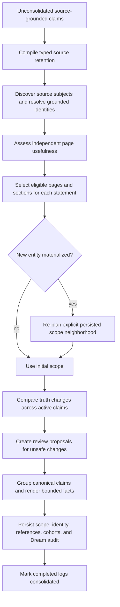

# Mycelium Design and Internals

This document describes how Mycelium is organized and how information moves through the system. For installation and day-to-day use, start with the [README](README.md).

## System overview

Build Memory extracts statements and accounts for source segments in one structured response per batch.
The model writes claims first, then explicit `source_only` reasons for the uncited remainder. Code derives
`claimed` dispositions from exact citations; the model does not classify cited segments a second time.
Citations and the source-only remainder must form a disjoint, complete partition. Omissions fail visibly and
remain retryable, never implicitly source-only. Earlier conversational context can resolve references,
but its original segment IDs must be cited separately and it is not re-extracted as new evidence.
An extraction batch has one pending/failed/complete status. Validated model output is saved temporarily before
claim writes, reused after write interruption, and discarded once the completed batch is durably recorded.
Identity organization and cumulative fact synthesis remain separate downstream stages.

Mycelium is made of three primary layers:

- A Python memory library that handles retrieval, source-grounded encoding, consolidation, and claim-level reconsolidation
- A FastAPI backend that owns persistent chat sessions and explicit memory operations
- A React web UI for chat, memory inspection, reconciliation review, and meeting ingestion

Ollama provides the local language-model runtime. Core memory and chat state use a canonical SQLite database with inspectable JSON records and Markdown projections; Engram keeps its separate meeting-processing database.

## Project structure

```text
mycelium/
├── engram/             # Meeting upload, transcription, diarization, and ingestion
├── mycelium/           # Core memory library
│   ├── core.py         # Composition root and public Mycelium facade
│   ├── pipeline.py     # Authoritative high-level memory lifecycle
│   ├── operations.py   # Typed lifecycle inputs and outputs
│   ├── retrieval.py    # Read-only memory retrieval orchestration
│   ├── claim_index.py  # Rebuildable LanceDB hybrid claim index
│   ├── retrieval_context.py # Budgeted claim/fact/source context rendering
│   ├── encoder.py      # Transcript-to-source/episode/claim encoding
│   ├── dream.py        # Consolidation preparation, execution, and commit
│   ├── reconsolidation.py # Evidence-triggered proposal analysis and review
│   ├── materialization.py # Deterministic claim-to-wiki projection
│   ├── ollama.py       # Adapter around the official Ollama SDK
│   ├── prompts.py
│   ├── store.py        # Markdown wiki and log persistence
│   └── structured_outputs.py
├── server/             # FastAPI backend
│   ├── main.py         # App setup and API router registration
│   └── api/            # Session, memory, and Engram routes
├── ui/                 # React frontend (Vite, TypeScript, and Tailwind)
├── tests/              # Python test suite
├── examples/           # Direct library integrations
├── benchmarks/         # LoCoMo and MemoryAgentBench harness
├── scripts/            # Benchmark and networking helpers
├── mycelium.toml       # Runtime configuration
├── start.sh            # Backend/frontend development launcher
└── pyproject.toml      # Python package and uv configuration
```

## Memory lifecycle

The authoritative library entry point is `MemoryPipeline`, composed by `Mycelium`. Its operations have explicit
contracts:

```text
SourceInput          -> ingest_source()    -> IngestionResult
RetrievalRequest     -> retrieve_context() -> RetrievalResult
ConsolidationRequest -> consolidate()      -> ConsolidationResult
```

The FastAPI server, Engram, benchmarks, examples, and direct Python integrations all use these same operations.
Lower layers implement one concern each: `Encoder` persists sources and extracts claims, `MemoryRetriever` selects
read-only assistant context, `ConsolidationProcess` coordinates semantic consolidation, and repository/materializer
classes persist canonical artifacts and generated views.

### 1. Chat and retrieval

When a user sends a message, the backend builds a retrieval query from the chat title, recent thread context,
and current message. A local LanceDB projection performs hybrid vector and full-text search over active canonical
and short-term claims. EmbeddingGemma supplies normalized semantic embeddings through Ollama. The index is derived
state: it is synchronized from canonical SQLite claim records and can be deleted and rebuilt without losing memory.

Hybrid similarity only proposes candidates. A structured model decision orders complementary claim IDs and reports
supported aspects and remaining gaps using canonical text, timing, consolidated representations, and exact cited
source excerpts. Selection and answering use the same evidence representation and budget rules, so a detail
preserved only in the source can make its claim useful to the request.
When complete candidates exceed the input budget, selection runs in bounded
chunks and then compares the surviving complete records together. That final
decision supplies the global order and gap report. If the survivors cannot fit
one comparison, admission returns an explicit budget error; failed chunks never
publish a partial selection. Single-batch requests retain one selection call.
Admission reads a canonical snapshot and reselects once if consulted state changes during inference; a repeated
conflict or broken citation produces a typed error. Admitted order forms a small initial evidence result. The stable system prompt contains only the
assistant's behavior contract; the current request carries runtime-supplied evidence as a separate structured
Markdown/pseudo-XML workspace. The assistant can then call `memory_search` with focused follow-up queries when a
requested person, event,
relation, or time is still unsupported, and can call `memory_sources` for the exact dialogue behind any claim already
shown during that response. Search count, result count, and cumulative evidence tokens are bounded per response;
subsequent searches omit claims already returned.

The workspace is transient state owned by the runtime, not a model-managed notebook. Each successful memory operation
merges complete typed records or sources by ID and revision and appends an inspectable operation entry. Source text,
citations and interpretation status refresh after successful and failed tools. Newer revisions replace obsolete
evidence; equal revisions merge exact citations. Eight recent operations are retained, and model-facing diagnostics
fit the whole workspace budget. The newest memory
tool message contains the one complete current workspace; the initial workspace is removed from the request and older
full workspace messages become compact supersession receipts. Assistant reasoning and tool calls remain in the
chronological message history. This prevents duplicate evidence from accumulating while preserving the evidence found
across a multi-step traversal. The final workspace is stored on the assistant transcript entry and can be inspected in
the chat UI.

Included canonical claims are represented through their consolidated facts; claims without a fact are represented
directly. Initial evidence and tool results share one schema containing explicit subjects, statements, claim IDs,
normalized timing, and source citations. Initial retrieval and follow-up search include the exact cited lines that
fit after their complete interpretation records. The assistant can use `memory_sources` with supporting claim IDs
to expand the bounded structural conversation neighborhood. The transcript remains
chronological, with cited lines marked in place. Retrieval traces preserve candidate rank, hybrid score, admission
decision, selected claim IDs, and the claims that fit in the final budget.

Retrieval is read-only. It never reinforces, destabilizes, or rewrites a page.

Typed evidence is also the budgeted retrieval unit: complete records are fitted against their actual rendered
envelope, and chat fits those same records against the complete prompt using the shared token estimator.
Source excerpts retain whole segments, source status and exact claim links; omitted evidence sets `more_available`.
Uncited neighboring dialogue requires a retained cited anchor and is expanded only on request.
Synthetic `WikiPage` objects no longer participate in retrieval
or chat admission. `RetrievalResult.page_references` and `Session.page_references` contain only navigation metadata
for real wiki pages associated with admitted evidence. Chat's `loaded_pages` metadata describes those references
after prompt fitting, not page bodies supplied to the model. Unowned claims do not require a page to be admitted.
Budgets too small even for the empty evidence envelope raise an explicit error.

### 2. Assistant tools

The chat model can call the read-only `memory_search` and `memory_sources` tools alongside Ollama `web_search` and
`web_fetch`. All tool calls are displayed in the UI and stored on the assistant message. Web results are external
observations and are captured immediately as sources; their extraction waits for Build Memory. Memory-tool results are reads
of existing evidence and are not re-ingested as new memories.

Memory results use one Markdown/pseudo-XML renderer. Search records put their statement and subject before supporting
IDs and citations. Source results explicitly map each claim to its cited segment IDs, then present the surrounding
transcript in chronological order. Tools bound their own output by admitting only complete records and segments; the
agent runtime never slices a serialized tool result. Persisted tool events retain the incremental raw result for
auditing, while the model receives the full current workspace after each memory operation.

The tool-specific extraction policy for web observations keeps source-grounded project facts while ignoring transport
metadata, failures, and page furniture.

### 3. Automatic source capture and explicit extraction

Each completed web chat turn is persisted in the session transcript, then captured as a source with stable
idempotency keys, exact segment timestamps, and speaker roles. A captured-turn cursor advances only after the
turn and its non-memory tool observations are saved. If capture fails, the reply remains saved, the UI reports
pending capture, and the next turn or Build Memory retries. There is no duplicate active-episode buffer.

Capture writes a raw log, SourceDocument, EpisodeManifest, and IngestionOperation without model calls or indexing.
Library ingest_source has the same capture-only contract. Reviewed meeting transcripts are admitted before optional
summary generation; a failed summary is retryable without recapturing or reopening the retained source for edits.

Build Memory snapshots source IDs, extracts unfinished batches, and runs the existing organizer on that snapshot.
New sources arriving during the build remain pending. The library serializes builds; web capture recovery happens
under per-session locks before the build snapshot. Existing extraction stages and persisted batch recovery remain.
Extracted sentences preserve source commitment level, negation, conditions, and reported attribution. Tentative
possibilities are durable memories, not definite plans; explicit commitments are not weakened into possibilities.
Categories and confidence scores do not substitute for these qualifiers in the readable statement.

Web turn sources point to up to four preceding captured turns for extraction context rather than duplicating their
text. Earlier context is capped at one quarter of the model context window using complete source groups. Coverage
classifies only new segments; extracted statements can separately cite exact context segment IDs. These citations
are persisted against their original sources. Earlier context is not re-extracted as new evidence occurrences.
This preserves bounded cross-turn interpretation; it does not promise unlimited conversation context.

Memory search still discovers extracted statements, not unbuilt transcripts or rendered wiki pages.
Source inspection follows citations. The UI distinguishes captured sources awaiting a build from built memories.

### 4. Build Memory organization

The dream process converts source-grounded claims into semantic wiki pages:



Important behavior:

- Routing uses exact batch-local alias accounting and fails closed on malformed output.
- Source-grounded claims are the canonical memory. Consolidated facts are current presentation artifacts only:
  obsolete facts are deleted when claims are regrouped or superseded, while the underlying claims and their
  relationship history remain durable.
- Assistant/system conversation claims and extraction-rejected segments remain source history under closed,
  provenance-linked retention reasons rather than masquerading as deferred or canonical memory.
- `source_only` is not a model-authored scope outcome: every admitted claim is placed or explicitly deferred.
- Subject discovery first inventories source referents and types without exposing the identity registry or
  prior review metadata. A separate structured assignment binds reviewed identity occurrences to those subjects.
  Explicit source user roles and accepted human reviews then constrain exact canonical identity IDs. Remaining
  subjects receive registry candidates across inferred types, at most 24 each, and a structured existing/new/review-required
  decision. Declared speakers remain restricted to people. Matching retains canonical types and establishes the
  preferred source-backed title; discovery labels cannot overwrite that decision. Candidate retrieval uses model embeddings with changed-document and query reuse; it never uses
  lexical identity rules. These stages preserve cited claim/participant evidence for inspection. Candidate
  limits bound individual matching requests, not the cost of reading the full identity history.
- Page usefulness is independent of identity confidence. A known identity can exist without a page; the persisted
  state is still named `provisional`, but there is no maturity threshold or continuity verifier. Pages without
  selected statements are not manufactured from participant encounters. External speakers who only report facts about
  others may remain source participants without becoming memory identities.
  A separate structured admission decision requires a type-specific positive basis and cited claims before a
  provisional subject becomes eligible for placement. Previously materialized subjects remain eligible. Only
  subjects resolved from the source enter the placement domain; You is not an implicit destination for every claim.
- Uncertain identities remain reviewable proposals and defer affected routing. Existing registry IDs/types and
  explicit human identity decisions cannot be overridden by the planner. Historical audit record readers and
  manual organization APIs remain; retired maturity-assessment storage, contracts, and UI have been removed.
  Review proposals retain exact candidate identity IDs and source evidence across reloads; pending-review context
  includes those candidates and the explanation, not just a proposed title.
- One subsequent placement response selects one or more useful page/section destinations for each claim among
  admitted subjects. A page-ID-keyed object makes one explicit decision per eligible page: a type-valid
  section or `not_selected`, with a reason. One statement may appear on several pages but has only one chosen
  section on each page. Select destinations before the primary owner; the owner must be one of the selected pages.
  Routing records the decisions' reasons, but only selected destinations enter persisted placements. The primary owner
  remains an internal synthesis grouping, not an exclusive display destination. `ClaimPlacement.page_sections`
  records the chosen views; the source statement is stored once.
  Claims without a suitable page remain searchable independently of the wiki. Completed identity plans are
  reconsidered against the current registry on later runs; failed routing reuses its saved plan and exact allocated
  IDs, avoiding duplicate identities after a partial commit. Old-cascade caches are not reused by the new contract.
- Unusually large claim sets are split into bounded work units. Global truth-change review precedes owner-scoped
  presentation. Cumulative presentation selects relevant prior facts, then groups their canonical members and
  at most twelve new claims. Each group declares one to twelve exact members, section, state, prominence, and
  rationale. Code validates complete, nonduplicated membership. Singleton text copies the canonical display
  statement; each multi-claim group receives a separate prose call constrained to its members and temporal records.
  Stable local aliases allow unchanged group prose to be reused even when neighboring groups change. Successful
  structured responses are durably keyed by the actual request, schema, settings, and model weight digest.
  There is no separate model verification or repair stage for prose, so semantic coverage still requires evaluation.
  Manually edited facts retain their exact text and evidence membership while those members remain active and
  correctly owned. New claims cannot be silently added to unchanged manual prose.
  Pending reviews protect whole existing facts from regrouping; newly arriving sides remain separately visible.
  Both sides retain their canonical evidence. Presentation cannot resolve a truth-change review.
  Existing fact-ID reuse, selected-view projection, and commit recovery remain. Scope-neighborhood revision is
  triggered only by actual identity creation or first materialization, not routine updates to existing identities.
  Bounded groups and request reuse do not bound the first-build scan of active claims or prior owner facts;
  growing-store cost remains an acceptance concern.
  Additions preserve successful batches when another batch fails; only failed claim IDs remain retryable. Changes
  to existing placements retain owner-scoped atomicity. Pending proposals created by earlier batches protect
  accepted facts in later batches of the same build, before anything is persisted.
  Placement batches target at most 32 claim/page decisions while retaining every eligible page (a registry larger
  than 32 still receives one complete row). Routing failures keep their source logs pending rather than reporting
  them consolidated.
  Truth review requires evidence of incompatible values for the same particular state/event or an actual
  replacement. A shared topic, newer recording time, or another independent plan is insufficient. Genuine
  changes create review proposals without automatically mutating accepted statements.
- General selected placements replace the special person/project projection rule. Incidental mentions do not
  automatically receive a copy. Shared views retain the same claim IDs and provenance; if only part of a synthesized
  group was selected for a page, that view renders only the selected canonical statements, not unrelated group text.
  Removing a destination or retracting a claim regenerates affected pages. Empty non-You pages are removed, while
  their subject identities remain available for future placements. Reading pages does not create extra stored facts.
- Claim entity references preserve extracted surface mentions and stable subject, object, context, and owner IDs.
- Scope revision uses persisted source/cohort/entity-reference neighborhoods, never token or alias overlap.
- `_index.md` is rebuilt deterministically from materialized pages.
- Dream records source outcomes, claim dispositions, proposal IDs, and failures.

### 5. Reconsolidation

New source-grounded claims are compared with active canonical claims across page owners, including unplaced
statements and other claims from the same batch. Candidate requests contain at most twelve incoming and twelve
candidate records, with exact decisions for each eligible pair; total candidate work still grows with the store.
Selected pairs receive a separate comparison grounded in cited source segments, temporal records, and identity
bindings. No-change decisions preserve both claims; contradictions and directional supersessions become durable
review proposals. Exact previously reviewed pairs are not proposed again.

A pending proposal is the lability window: both claims remain active and generated pages display a pending marker. Approval updates canonical claim links or status and immediately invokes the same deterministic materializer used by Dream. Rejection preserves both claims as unrelated. Pages are never rewritten from a query or from model-authored correction prose.

## Web sessions and direct library sessions

The web app owns long-lived session transcripts and automatic completed-turn capture in `server/runtime.py`. Ordinary chat content and non-memory tool observations are saved as sources after the reply, without running extraction.

The direct Python API can call `retrieve_context`, `ingest_source`, and `consolidate` explicitly with typed contracts.
`Mycelium.session()` is an ergonomic conversational wrapper: it retrieves typed evidence and real wiki page references on entry and ingests recorded messages
on exit. Consolidation remains an explicit operation.

## Memory operations

The backend does not schedule memory builds. POST /api/memory/build captures any pending saved turns and invokes
the library's explicit consolidate operation. GET /api/memory/build/status exposes pending-source and statement
counts, not age or size readiness thresholds. Flush and run-if-ready endpoints have been removed.

The UI exposes Build Memory, proposal review, and development resets. The model declares separate time entries with
verbatim wording, action/state targets, event/deadline/condition roles and exact citation IDs. Calendar arithmetic
resolves declared offsets/periods; it never interprets prose. Vague or unsupported dates stay unresolved. Relative
dates use supporting segment timestamps; source occurrence time is eligible only when no segment in that source has
a timestamp. Schema 2 requires fresh stores.

Relative-date corrections create durable previews and require explicit reference choices before application. The
reviewed metadata, submission time and cited reference provenance persist across retries, with claim/source
fingerprints rejecting stale drafts. Absolute/no-relative-time corrections apply directly. Corrections rebuild
affected memory independently of a build. Internal Dream artifact names still describe
the retained organizer and audit records; this increment does not redesign those semantic stages.

## Architecture authority and validation

This document describes the intended current production architecture. Dated files under `planning/` are
historical design and audit records unless they explicitly say otherwise. When a production mechanism changes,
update this document and the user-facing README in the same change.

A memory milestone is complete only when its implementation checklist and declared acceptance conditions pass.
Use the following repository checks before checkpointing a change:

```bash
uv run ruff check mycelium server tests benchmarks
uv run pytest -q
cd ui && npm run lint && npm run build
git diff --check
```

Semantic milestones must additionally run their named behavioral fixture protocol, including required transfer
fixtures and repeated trials. Unit tests with mocked model outputs establish mechanics, not semantic acceptance.

### Semantic LLM development workflow

Prompt, ontology, and model-labor changes follow a direct-first workflow:

1. State the product-level semantic invariant without referring to a benchmark example.
2. Call the configured host Ollama model directly with the real production prompt and structured schema. Use a
   small neutral case that isolates the decision, followed by a counterexample that could expose over-admission or
   false identity merging.
3. Integrate only the smallest mechanism that worked directly. Exact evidence aliases, schema values, and registry
   IDs belong in structured contracts; human-language meaning remains a model decision with cited evidence.
4. Run focused contract and pipeline tests, then exercise the integrated path with the real configured model.
5. For downstream semantic work, replay frozen extraction artifacts so extraction variance does not obscure entity,
   admission, ownership, or projection changes. Inspect persisted decisions and failure reasons as well as scores.
6. Treat timeouts, connectivity failures, and malformed contracts as invalid semantic evidence. Rerun after the
   environmental or structural problem is resolved.
7. Record direct probes, in-situ run paths, results, and remaining failures in `DEVLOG.md`. A candidate reaches
   acceptance only after the fixture's required repeated primary and transfer trials pass.

The host Ollama service is normally `http://localhost:11434`. Sandboxed agents must verify it through a read-only
`/api/tags` request with network escalation and use the same escalation for probes and benchmarks. They must not
start another server, change the configured URL, or substitute a fallback model to bypass sandbox isolation.

## Storage layout

The default store is `./mycelium_store`; the server accepts `MYCELIUM_STORE` for a
fresh alternative, and library/benchmark callers select their own store directory.

```text
mycelium_store/
├── memory.sqlite3      # Canonical artifacts, raw logs, chat summaries/messages, receipts and revisions
├── .writer.lock        # OS-backed ownership; not copied into snapshots
├── wiki/               # Generated Markdown pages and _index.md
│   └── _archive/       # Archived generated pages
├── logs/               # Generated daily raw-log views
├── indexes/lancedb/    # Rebuildable claim search projection
└── diagnostics/        # Model timing and optional request diagnostics
```

A shared process-local handle owns the SQLite connection and an OS-backed lock.
Other writer processes fail before accessing the store. SQLite uses WAL, foreign
keys, indexed record lookups, transactional revisions and a unique entity-slug index.
Ordinary operations and explicit close remain bound to the creating thread. Resource
collection can safely release a handle on another thread under the same lock that
protects transactions; it does not permit concurrent cross-thread database use.
Chat summaries are separate records from messages, so sidebar listing never loads
transcripts. Old JSON stores are rejected; this release has no migration backend.

Model-driven lifecycle edits use a consistent database read snapshot with an
isolated write set. Publication validates consulted record/collection revisions in
a short write transaction, preserving unrelated capture and rejecting actual conflicts.
No write transaction is held across model calls. Synchronous curation and ingestion
also commit atomically. Dream journals record plans and errors, but application rolls
back completely on failure; a failed plan cannot strand partially changed entities.

Intended Markdown content/deletions are committed with canonical changes in a durable,
ordered publication queue. Atomic file replacement is retryable without model work or
new page versions. The inspector exposes failures and retry. This provides recoverable
eventual Markdown publication, not a cross-filesystem/database atomic transaction.

Claim indexing uses database collection revisions and changed IDs, including claims
whose owner changed. Incremental lookups/deletions use batches of at most500 IDs;
unchanged search performs no artifact-directory scan. Index checkpoints advance only
after successful synchronization. Embedding revisions include the configured model's
actual weight digest; changed weights rebuild the derived index, including dimension
changes. Invalid vectors or weights changing during generation fail explicitly.
At 10,000 claims, an IVF_FLAT L2 index partitions storage into 100 groups and searches
all partitions; smaller stores bypass the index. Unindexed appends remain searchable.
This preserves exhaustive vector search while reducing measured local query overhead;
it does not establish semantic retrieval recall or end-to-end QA quality.

Snapshots use SQLite backup and reconstruct Markdown from the backed-up records;
they exclude locks and rebuildable indexes. `python -m mycelium.snapshots` exports
canonical JSONL records for inspection. Benchmarks, lifecycle services, and runtime
code use repositories rather than artifact-file paths. Engram storage remains separate.

## Configuration

Runtime settings live in `mycelium.toml`:

```toml
[llm]
model = "gemma4:12b"
url = "http://localhost:11434"
temperature = 1.0
context_window_tokens = 65536
reasoning_enabled = false

[session]
context_budget_tokens = 32768

[engram.whisper]
model = "large-v3"
device = "auto"
compute_type = "auto"
batch_size = 8
```

`llm.context_window_tokens` controls token-aware ingestion batching. It is separate from `session.context_budget_tokens`, which limits how much retrieved memory is loaded into chats. Dream projection defaults live in `mycelium/config.py`.

Explicit constructor/CLI overrides take precedence over a requested TOML file,
then dataclass defaults. Missing requested files and invalid values fail before
store creation. A `Mycelium` instance takes a copied, validated `Config` or a
`config_path`. Benchmark clients capture their settings once for all cases;
daily-driver trials share the same captured configuration. LoCoMo resume checks
compare full effective memory and QA settings, including URLs and sampling.

## Engram meeting pipeline

Engram stores uploaded meeting audio before processing it. The UI then starts an explicit processing workflow:

1. `faster-whisper` produces a timestamped transcript.
2. WhisperX aligns the transcript and pyannote assigns speaker labels.
3. The user reviews and can edit the transcript and speaker names.
4. Finalization freezes the transcript, speaker names and meeting metadata, then
   captures it as a durable source/log/episode through the normal memory API.
5. Ollama generates an optional structured summary, retained with the meeting.
   Summary failure does not undo source admission; retries reuse the saved source.

One operation owns a meeting at a time. Speech work also holds a device lock.
Cancellation waits for a native worker to finish before releasing that lock or
removing its audio file; queued jobs cancel immediately. Deletion waits for
in-flight source admission to finish its bookkeeping and skips subsequent summary
generation. Removing an Engram meeting does not retract memory already admitted.

Typed warning records distinguish diarization and summary failures from fatal
processing/admission errors. Successful retries resolve warnings while retaining
history. Interrupted diarization returns the existing transcript to review;
interrupted finalization keeps its durable edit lock and can retry unchanged.
SQLite foreign keys prevent late segment writes from orphaning deleted meetings.

Install the optional dependencies with:

```bash
uv sync --group engram
```

If the speech stack has resolution problems with Python 3.13, create the environment with Python 3.11:

```bash
uv python install 3.11
uv sync --python 3.11 --group engram
```

By default, `device = "auto"` and `compute_type = "auto"` select CUDA/`float16` when a CUDA-visible NVIDIA GPU is available, and CPU/`int8` otherwise. The path can be forced in `mycelium.toml`:

```toml
[engram.whisper]
device = "cuda"
compute_type = "float16"
```

Diarization requires accepting the terms for `pyannote/speaker-diarization-community-1` and exporting a Hugging Face token:

```bash
export HF_TOKEN=your_hugging_face_token
```

Uploaded recordings are copied to `mycelium_store/engram/audio/`. They initially appear as `ready`, move to transcript review after processing, and enter memory only after finalization.

### AMI smoke tests

With the AMI meeting subset available under `AMI/`, the slow transcription comparison can be enabled explicitly:

```bash
ENGRAM_RUN_AMI_TRANSCRIPTION=1 uv run pytest tests/test_engram_transcribe_ami.py
```

Optional overrides include:

```bash
ENGRAM_AMI_MEETINGS=ES2002a \
ENGRAM_AMI_WHISPER_MODEL=base.en \
ENGRAM_AMI_OUTPUT_DIR=test_outputs/ami_transcripts \
ENGRAM_RUN_AMI_TRANSCRIPTION=1 \
uv run pytest tests/test_engram_transcribe_ami.py
```

The test writes `*.whisper.txt`, `*.reference.txt`, and `*.segments.json` for manual comparison. A five-minute WhisperX/pyannote diarization comparison can be run with:

```bash
HF_TOKEN=your_hugging_face_token \
ENGRAM_RUN_AMI_DIARIZATION=1 \
ENGRAM_AMI_DIARIZATION_MEETING=ES2002a \
ENGRAM_AMI_WHISPER_MODEL=base.en \
uv run pytest tests/test_engram_transcribe_ami.py::test_diarize_ami_first_five_minutes_with_whisperx_for_manual_comparison -s
```

Add `ENGRAM_AMI_WHISPER_DEVICE=cpu ENGRAM_AMI_WHISPER_COMPUTE_TYPE=int8` to force CPU inference. The diarization test writes diarized text, segment data, reference words, and metrics under `test_outputs/ami_transcripts/`.

## Remote access and WSL

The frontend derives its backend origin from the hostname used to load the page. For example, loading `http://192.168.x.x:5173` makes API requests to `http://192.168.x.x:8000/api`. Override that behavior with `VITE_API_ORIGIN`:

```bash
cd ui
VITE_API_ORIGIN=http://localhost:8000 npm run dev
```

Keep Ollama bound to localhost; only the backend needs to communicate with it.

For WSL on Windows, mirrored networking lets other trusted LAN or Tailscale devices reach the WSL development servers. Add the following to `C:\Users\<you>\.wslconfig`:

```ini
[wsl2]
networkingMode=mirrored
```

Restart WSL from PowerShell with `wsl --shutdown`, restart Mycelium, then connect to `http://<windows-lan-or-tailscale-ip>:5173`.

If mirrored networking is unavailable, the repository includes a port-proxy helper. Run it from an Administrator WSL terminal:

```bash
powershell.exe -ExecutionPolicy Bypass -File "$(wslpath -w scripts/Expose-MyceliumWsl.ps1)" -SetPrivateNetwork
```

## Benchmarks

The benchmark harness compares Mycelium with a no-memory baseline and a full-context baseline. Keep benchmark repositories adjacent to this repository:

```text
/home/user/Development/
├── mycelium/
├── locomo/
└── MemoryAgentBench/
```

Run a small LoCoMo smoke benchmark:

```bash
uv run python -m benchmarks locomo \
  --locomo-path ../locomo/data/locomo10.json \
  --system mycelium \
  --qa-model gemma4:12b \
  --memory-model gemma4:12b \
  --max-samples 1 \
  --max-questions 3
```

Run a selected LoCoMo conversation directly from the repository root:

```bash
.venv/bin/python -m benchmarks locomo \
  --config-path mycelium.toml \
  --qa-model gemma4:12b --memory-model gemma4:12b \
  --sample-index 2 --snapshot-sessions
```

The module generates a timestamped run ID automatically; pass `--run-id <name>` for a custom name.
Change the 1-based sample index as needed, or pass `--system null` or `--system full_context`
to run those baselines. Omitting the sample index runs all samples unless limited by `--max-samples`.

For a human-reviewed encoding/wiki baseline (no QA scoring), use a fresh run ID:

```bash
.venv/bin/python -m benchmarks locomo \
  --wiki-baseline --sample-index 1 --max-sessions 2 \
  --config-path mycelium.toml --qa-model gemma4:12b \
  --run-id locomo-wiki-before-external
```

Repeat with `--user-speaker Caroline --run-id locomo-wiki-before-user` to explicitly bind that exact speaker
to the configured user; names/dialogue remain unchanged. Without this flag both speakers are external participants.
This mode seeds the default You identity, captures each session through the current public API, and runs Build
Memory after each session. It rejects reused output directories and derived-store replay options.

Each run retains `input.json` (selected raw conversation only, no QA/answers), `messages.json` (explicit roles and
turn labels), `manifest.json` (input hashes, effective configuration, build outcomes), `working_tree.patch`, and
full `snapshots/initial`, `snapshots/session_1`, `snapshots/session_2` stores. Open each snapshot's `wiki/` folder
to compare organization over time; sources, claims, identity decisions, and build failures remain beside it.
These are measured baselines, not automatic assertions that the resulting wiki is correct. A fresh after-run
should use identical input hashes, model configuration, user mapping, and session/build cadence. Model outputs
can vary; page-title equality and LoCoMo QA scores are not the acceptance criteria for this comparison.

For a MemoryAgentBench smoke run:

```bash
uv run python -m benchmarks mab \
  --mab-root ../MemoryAgentBench \
  --dataset-config ../MemoryAgentBench/configs/data_conf/Accurate_Retrieval/EventQA/Eventqa_64k.yaml \
  --system mycelium \
  --qa-model gemma4:12b \
  --memory-model gemma4:12b \
  --max-contexts 1 \
  --max-queries 3
```

For full runs, omit sample limits and select each system or MAB dataset explicitly.
See the [benchmark guide](benchmarks/README.md) for commands and the curated MAB configuration list.
The default dream policy is `per-batch`; use `--dream-policy per-case` explicitly when needed.

The Daily Driver fixture is the behavioral protocol for entity, ownership, lifecycle, and wiki-coherence work.
Validate it before use:

```bash
uv run python -m benchmarks daily-driver \
  validate benchmarks/suites/daily_driver/fixtures/daily_driver_v1
```

For a downstream semantic iteration, replay a known extraction store into a fresh output directory:

```bash
uv run python -m benchmarks daily-driver run \
  benchmarks/suites/daily_driver/fixtures/daily_driver_v1 \
  --run-id <candidate> \
  --replay-extraction-store benchmark_runs/<baseline>/store \
  --config-path mycelium.toml
```

This replay copies only source, episode, claim, and raw-log evidence, then reruns identity, admission, ownership,
reconsolidation, materialization, retrieval, and evaluation. Projection-only work may instead replay assignments;
retrieval-only work may use an exact frozen store. See the
[fixture guide](benchmarks/suites/daily_driver/fixtures/daily_driver_v1/README.md) for those modes, three-trial primary acceptance, and
the paraphrased and unrelated-domain transfer fixtures.

The current page-structure milestone accepts page admission, stable identity separation, entity relationships,
claim ownership, and coherent page organization. Correction, retraction, retrieval, and answering are separate
milestones. Their dimensions and probes remain in Daily Driver reports so regressions stay visible, but only entries
under a fixture's active `gates` are hard safety blockers; `deferred_gates` name later acceptance checks. Passing
the gates is necessary but not sufficient: every dimension named in `acceptance.dimensions` must reach its target.

## Development

Run the backend tests:

```bash
uv run pytest
```

Build the frontend:

```bash
cd ui
npm run build
```

The UI renders Markdown, GitHub-flavored tables and lists, and KaTeX notation.

Current implementation notes:

- The backend allows broad CORS access for local development and should be tightened before deployment.
- The combined `start.sh` launcher is intended for development; the backend can also be started independently with `uv run python -m server.main`.
