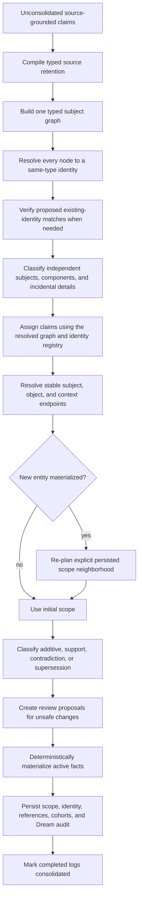

# Mycelium Design and Internals

This document describes how Mycelium is organized and how information moves through the system. For installation and day-to-day use, start with the [README](README.md).

## System overview

Mycelium is made of three primary layers:

- A Python memory library that handles retrieval, source-grounded encoding, consolidation, and claim-level reconsolidation
- A FastAPI backend that owns persistent chat sessions and explicit memory operations
- A React web UI for chat, memory inspection, reconciliation review, and meeting ingestion

Ollama provides the local language-model runtime. The core agent memory is composed of Markdown and JSON files rather than an opaque database; the optional Engram pipeline uses SQLite for meeting-processing state.

## Project structure

```text
mycelium/
├── engram/             # Meeting upload, transcription, diarization, and ingestion
├── mycelium/           # Core memory library
│   ├── core.py         # Facade, retrieval, sessions, and dream entry point
│   ├── encoder.py      # Transcript-to-source/episode/claim encoding
│   ├── dream.py        # Claim routing and consolidation orchestration
│   ├── reconsolidation.py # Evidence-triggered proposal analysis and review
│   ├── materialization.py # Deterministic claim-to-wiki projection
│   ├── ollama.py       # Adapter around the official Ollama SDK
│   ├── prompts.py
│   ├── store.py        # Markdown wiki and log persistence
│   └── structured_outputs.py
├── server/             # FastAPI backend
│   ├── main.py         # App setup and API router registration
│   └── api/            # Session, memory, and Engram routes
├── ui/                 # React frontend (Vite, TypeScript, and Tailwind)
├── tests/              # Python test suite
├── examples/           # Direct library integrations
├── benchmarks/         # LoCoMo and MemoryAgentBench harness
├── scripts/            # Benchmark and networking helpers
├── mycelium.toml       # Runtime configuration
├── start.sh            # Backend/frontend development launcher
└── pyproject.toml      # Python package and uv configuration
```

## Memory lifecycle

### 1. Chat and retrieval

When a user sends a message, the backend builds a retrieval query from the chat title, recent thread context,
and current message. A disposable in-memory SQLite FTS5 index ranks complete wiki pages with BM25. Exact
title/entity mentions and structured temporal matches may add pages before the context budget is applied.

Loaded pages are placed in the chat system prompt along with compact snippets from their backlinked raw logs. The entire current session transcript is then passed to the chat model.

Retrieval is read-only. It never reinforces, destabilizes, or rewrites a page.

### 2. Tool observations

The chat model can call Ollama `web_search` and `web_fetch`. Tool calls are:

- Executed by the internal Ollama adapter
- Displayed in the UI with expandable arguments and results
- Stored on the assistant message in session history
- Encoded immediately through the same source, episode, and claim pipeline as conversations

The tool-specific extraction policy keeps source-grounded project facts while ignoring transport metadata, failures, and page furniture.

### 3. Episode encoding

Each saved chat message carries its own server-recorded UTC timestamp. This lets one active episode span
multiple days without treating every message as if it happened when the episode began or was flushed.

Each web chat keeps an active episode buffer. An episode is flushed only through an explicit API or web UI
operation:

- Manually through **Flush Current** or **Flush All**
- Through **Flush Idle** when the caller wants idle or large episodes processed

The encoder writes the complete conversation episode into a durable raw log, a structured source document, an episode manifest, and atomic claims. Extraction makes one logical pass and records claimed, ignored, partial, and failed segment coverage.

Encoded episode IDs are tracked in `mycelium_store/sessions_meta.json`, preventing an already-flushed episode from being encoded repeatedly unless the memory store is cleared.

### 4. Dream consolidation

The dream process converts source-grounded claims into semantic wiki pages:



Important behavior:

- Routing uses exact batch-local alias accounting and fails closed on malformed output.
- Assistant/system conversation claims and extraction-rejected segments remain source history under closed,
  provenance-linked retention reasons rather than masquerading as deferred or canonical memory.
- `source_only` is not a model-authored scope outcome: every admitted claim is placed or explicitly deferred.
- Entity identity and page admission are separate. A known identity may remain provisional until supported by
  enough durable evidence; creation and participant-resolution decisions retain support, confidence, and review state.
- Identity planning starts with one type-neutral subject graph. Person and Organization are agents; Project is an
  intentional continuing effort; Series is a recurring frame; Event is one bounded occurrence; Artifact is a made
  physical or digital object; Topic is an abstract subject; and Place is physical. A particular occurrence remains
  separate from the Project or Series that contains it. Graph edges preserve strict containment, occurrence,
  participation, subject matter, location, use, production, and other explicit relationships before any page
  decision is made. Unresolved subjects use batch-local node IDs; already-known endpoints may copy only exact
  registry IDs. Evidence citations, stable endpoints, and participant references are constrained by the response
  schema to the exact values supplied for that cohort. Node and edge citations provide the graph audit trail;
  redundant explanatory prose is not requested.
- Every graph node then resolves to an exact same-type stable ID or a new identity. Proposed existing matches receive
  a separate pairwise check before they can mutate or own that identity. The configured user is the one structural
  exception: a redundant Person node may resolve to the singleton `you` ID and is still verified before mutation.
- Admission keeps three decisions separate. Scope says whether memory belongs independently, on a parent, or only
  in context. Memory evidence says whether useful personal state or history is accumulating, thin, or unclear.
  Evidence maturity says whether distinct source episodes or explicit prior history establish the subject, or it is
  still emerging. A graph node declared as `component_of` or `occurrence_of` is structurally constrained to component
  scope; this implements the meaning of those model-authored relations rather than reinterpreting source language in
  code. Only an independent node with accumulating memory and established evidence materializes. Other independent
  nodes stay provisional, while components and context-only details get no page. Existing materialized pages are
  never demoted by a thin later cohort.
- Claim ownership receives both the completed stable registry and the resolved graph. This lets a claim about a
  session, tool, milestone, feature, issue, or deliverable route to its lasting parent even though that component has
  no page. A final decision resolves subject, object, and context endpoints; links are those endpoints minus owner.
- Claim entity references preserve extracted surface mentions and stable subject, object, context, and owner IDs.
- Scope revision uses persisted source/cohort/entity-reference neighborhoods, never token or alias overlap.
- `_index.md` is rebuilt deterministically from materialized pages.
- Dream records source outcomes, claim dispositions, proposal IDs, and failures.

### 5. Reconsolidation

New source-grounded claims act as cues that reactivate a bounded set of older active claims. The classifier may mark the relationship additive, supporting, contradictory, or superseding. Additive claims route normally and supporting links apply automatically. Contradictions and supersessions become durable pairwise proposals.

A pending proposal is the lability window: both claims remain active and generated pages display a pending marker. Approval updates canonical claim links or status and immediately invokes the same deterministic materializer used by Dream. Rejection preserves both claims as unrelated. Pages are never rewritten from a query or from model-authored correction prose.

## Web sessions and direct library sessions

The web app owns long-lived session transcripts and explicit episode flushing in `server/runtime.py`. Ordinary chat content is logged when an episode is flushed, while tool observations are logged immediately.

The direct Python API uses the `Mycelium.session()` async context manager. It retrieves pages on entry and encodes recorded messages on exit. Dream remains an explicit operation.

## Memory operations

The backend does not start a scheduled memory task. The web UI and API expose explicit operations for current,
idle, or all episode flushing; Dream consolidation; proposal review; and development resets. **Flush Idle**
evaluates the idle and size rules only when the user invokes it. The direct Python API leaves Dream invocation
to its caller. Immediate tool-observation capture and direct session encoding remain part of the explicit chat
or library call that initiated them.

Chat and flush operations for one session are serialized. Session metadata is written atomically, so a flush
cannot overwrite a turn that arrived while model work was in progress. Relative dates in chat are anchored to
the timestamp of their exact supporting message segment. Sources without per-segment wall-clock timestamps use
their declared source occurrence time.

## Architecture authority and validation

This document describes the intended current production architecture. Dated files under `planning/` are
historical design and audit records unless they explicitly say otherwise. When a production mechanism changes,
update this document and the user-facing README in the same change.

A memory milestone is complete only when its implementation checklist and declared acceptance conditions pass.
Use the following repository checks before checkpointing a change:

```bash
uv run ruff check mycelium server tests benchmarks
uv run pytest -q
cd ui && npm run lint && npm run build
git diff --check
```

Semantic milestones must additionally run their named behavioral fixture protocol, including required transfer
fixtures and repeated trials. Unit tests with mocked model outputs establish mechanics, not semantic acceptance.

### Semantic LLM development workflow

Prompt, ontology, and model-labor changes follow a direct-first workflow:

1. State the product-level semantic invariant without referring to a benchmark example.
2. Call the configured host Ollama model directly with the real production prompt and structured schema. Use a
   small neutral case that isolates the decision, followed by a counterexample that could expose over-admission or
   false identity merging.
3. Integrate only the smallest mechanism that worked directly. Exact evidence aliases, schema values, and registry
   IDs belong in structured contracts; human-language meaning remains a model decision with cited evidence.
4. Run focused contract and pipeline tests, then exercise the integrated path with the real configured model.
5. For downstream semantic work, replay frozen extraction artifacts so extraction variance does not obscure entity,
   admission, ownership, or projection changes. Inspect persisted decisions and failure reasons as well as scores.
6. Treat timeouts, connectivity failures, and malformed contracts as invalid semantic evidence. Rerun after the
   environmental or structural problem is resolved.
7. Record direct probes, in-situ run paths, results, and remaining failures in `DEVLOG.md`. A candidate reaches
   acceptance only after the fixture's required repeated primary and transfer trials pass.

The host Ollama service is normally `http://localhost:11434`. Sandboxed agents must verify it through a read-only
`/api/tags` request with network escalation and use the same escalation for probes and benchmarks. They must not
start another server, change the configured URL, or substitute a fallback model to bypass sandbox isolation.

## Storage layout

The default store is `./mycelium_store`:

```text
mycelium_store/
├── sessions_meta.json  # Chats, transcripts, active episodes, and flush markers
├── logs/               # Daily raw episodic logs
├── wiki/               # Semantic memory pages and _index.md
│   └── _archive/       # Archived wiki pages
├── artifacts/          # Canonical evidence plus inspectable semantic decisions and derived facts
└── engram/             # SQLite meeting metadata and uploaded audio
```

The files are deliberately readable. Raw logs and claims are canonical; wiki pages are generated views and are read-only in the application.

## Configuration

Runtime settings live in `mycelium.toml`:

```toml
[llm]
model = "gemma4:12b"
url = "http://localhost:11434"
temperature = 0.2
context_window_tokens = 32768

[session]
context_budget_tokens = 32768

[engram.whisper]
model = "large-v3"
device = "auto"
compute_type = "auto"
batch_size = 8
```

`llm.context_window_tokens` controls token-aware ingestion batching. It is separate from `session.context_budget_tokens`, which limits how much retrieved memory is loaded into chats. Dream projection defaults live in `mycelium/config.py`.

## Engram meeting pipeline

Engram stores uploaded meeting audio before processing it. The UI then starts an explicit processing workflow:

1. `faster-whisper` produces a timestamped transcript.
2. WhisperX aligns the transcript and pyannote assigns speaker labels.
3. The user reviews and can edit the transcript and speaker names.
4. Ollama generates a structured meeting summary.
5. The finalized meeting is ingested into the normal raw log store as a durable, unconsolidated entry.

Install the optional dependencies with:

```bash
uv sync --group engram
```

If the speech stack has resolution problems with Python 3.13, create the environment with Python 3.11:

```bash
uv python install 3.11
uv sync --python 3.11 --group engram
```

By default, `device = "auto"` and `compute_type = "auto"` select CUDA/`float16` when a CUDA-visible NVIDIA GPU is available, and CPU/`int8` otherwise. The path can be forced in `mycelium.toml`:

```toml
[engram.whisper]
device = "cuda"
compute_type = "float16"
```

Diarization requires accepting the terms for `pyannote/speaker-diarization-community-1` and exporting a Hugging Face token:

```bash
export HF_TOKEN=your_hugging_face_token
```

Uploaded recordings are copied to `mycelium_store/engram/audio/`. They initially appear as `ready`, move to transcript review after processing, and enter memory only after finalization.

### AMI smoke tests

With the AMI meeting subset available under `AMI/`, the slow transcription comparison can be enabled explicitly:

```bash
ENGRAM_RUN_AMI_TRANSCRIPTION=1 uv run pytest tests/test_engram_transcribe_ami.py
```

Optional overrides include:

```bash
ENGRAM_AMI_MEETINGS=ES2002a \
ENGRAM_AMI_WHISPER_MODEL=base.en \
ENGRAM_AMI_OUTPUT_DIR=test_outputs/ami_transcripts \
ENGRAM_RUN_AMI_TRANSCRIPTION=1 \
uv run pytest tests/test_engram_transcribe_ami.py
```

The test writes `*.whisper.txt`, `*.reference.txt`, and `*.segments.json` for manual comparison. A five-minute WhisperX/pyannote diarization comparison can be run with:

```bash
HF_TOKEN=your_hugging_face_token \
ENGRAM_RUN_AMI_DIARIZATION=1 \
ENGRAM_AMI_DIARIZATION_MEETING=ES2002a \
ENGRAM_AMI_WHISPER_MODEL=base.en \
uv run pytest tests/test_engram_transcribe_ami.py::test_diarize_ami_first_five_minutes_with_whisperx_for_manual_comparison -s
```

Add `ENGRAM_AMI_WHISPER_DEVICE=cpu ENGRAM_AMI_WHISPER_COMPUTE_TYPE=int8` to force CPU inference. The diarization test writes diarized text, segment data, reference words, and metrics under `test_outputs/ami_transcripts/`.

## Remote access and WSL

The frontend derives its backend origin from the hostname used to load the page. For example, loading `http://192.168.x.x:5173` makes API requests to `http://192.168.x.x:8000/api`. Override that behavior with `VITE_API_ORIGIN`:

```bash
cd ui
VITE_API_ORIGIN=http://localhost:8000 npm run dev
```

Keep Ollama bound to localhost; only the backend needs to communicate with it.

For WSL on Windows, mirrored networking lets other trusted LAN or Tailscale devices reach the WSL development servers. Add the following to `C:\Users\<you>\.wslconfig`:

```ini
[wsl2]
networkingMode=mirrored
```

Restart WSL from PowerShell with `wsl --shutdown`, restart Mycelium, then connect to `http://<windows-lan-or-tailscale-ip>:5173`.

If mirrored networking is unavailable, the repository includes a port-proxy helper. Run it from an Administrator WSL terminal:

```bash
powershell.exe -ExecutionPolicy Bypass -File "$(wslpath -w scripts/Expose-MyceliumWsl.ps1)" -SetPrivateNetwork
```

## Benchmarks

The benchmark harness compares Mycelium with a no-memory baseline and a full-context baseline. Keep benchmark repositories adjacent to this repository:

```text
/home/user/Development/
├── mycelium/
├── locomo/
└── MemoryAgentBench/
```

Run a small LoCoMo smoke benchmark:

```bash
uv run python -m benchmarks.mycelium_bench locomo \
  --locomo-path ../locomo/data/locomo10.json \
  --system mycelium \
  --qa-model gemma4:12b \
  --memory-model gemma4:12b \
  --max-samples 1 \
  --max-questions 3
```

Quickly run the second LoCoMo conversation with `scripts/benchmark-locomo-convo2.sh`. Change `--system` to `null` for no persistent memory or `full_context` for the full-context baseline.

For a MemoryAgentBench smoke run:

```bash
uv run python -m benchmarks.mycelium_bench mab \
  --mab-root ../MemoryAgentBench \
  --dataset-config ../MemoryAgentBench/configs/data_conf/Accurate_Retrieval/EventQA/Eventqa_64k.yaml \
  --system mycelium \
  --qa-model gemma4:12b \
  --memory-model gemma4:12b \
  --max-contexts 1 \
  --max-queries 3
```

Full-suite helpers are available as:

```bash
scripts/benchmark-locomo-full.sh
scripts/benchmark-memoryagentbench-full.sh
scripts/benchmark-all-full.sh
```

They accept environment overrides such as:

```bash
QA_MODEL=llama3.1:8b MEMORY_MODEL=gemma4:12b RUN_TAG=claim-pipeline scripts/benchmark-all-full.sh
```

Full runs default to `DREAM_POLICY=per-case`; this can be changed, for example, with `DREAM_POLICY=per-batch scripts/benchmark-locomo-full.sh mycelium`. Results are written beneath `benchmark_runs/<run-id>/` as predictions, JSONL rows, and summaries. MemoryAgentBench may require its own dependencies and Hugging Face dataset downloads.

The Daily Driver fixture is the behavioral protocol for entity, ownership, lifecycle, and wiki-coherence work.
Validate it before use:

```bash
uv run python -m benchmarks.mycelium_bench.daily_driver \
  validate benchmarks/fixtures/daily_driver_v1
```

For a downstream semantic iteration, replay a known extraction store into a fresh output directory:

```bash
uv run python -m benchmarks.mycelium_bench.daily_driver run \
  benchmarks/fixtures/daily_driver_v1 \
  --output-dir benchmark_runs/<candidate> \
  --replay-extraction-store benchmark_runs/<baseline>/store \
  --config-path mycelium.toml
```

This replay copies only source, episode, claim, and raw-log evidence, then reruns identity, admission, ownership,
reconsolidation, materialization, retrieval, and evaluation. Projection-only work may instead replay assignments;
retrieval-only work may use an exact frozen store. See the
[fixture guide](benchmarks/fixtures/daily_driver_v1/README.md) for those modes, three-trial primary acceptance, and
the paraphrased and unrelated-domain transfer fixtures.

## Development

Run the backend tests:

```bash
uv run pytest
```

Build the frontend:

```bash
cd ui
npm run build
```

The UI renders Markdown, GitHub-flavored tables and lists, and KaTeX notation.

Current implementation notes:

- The backend allows broad CORS access for local development and should be tightened before deployment.
- The combined `start.sh` launcher is intended for development; the backend can also be started independently with `uv run python -m server.main`.
