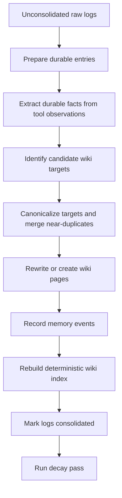

<p align="center">
  
</p>

# Mycelium

Mycelium is a local, plain-text memory system for LLM agents. It stores raw experience as episodic logs, consolidates useful knowledge into a Markdown wiki, and reloads relevant wiki pages into future chats.

The project includes a Python memory library, a FastAPI backend, and a React web UI for chatting with a local Ollama model and inspecting or operating on the memory store.

## Core Features

- **Plain-text memory store:** Wiki pages and episodic logs are Markdown, while source documents, episode manifests, and atomic claims are inspectable JSON under `mycelium_store/`.
- **Multi-session chat UI:** Create, rename, resume, and continue multiple chat sessions without treating each individual message as a full session.
- **Long-term memory retrieval:** Each chat turn routes against the wiki index and loads relevant pages into the assistant's system context.
- **Source-grounded episodic logs:** Active chat episodes flush into raw durable logs that remain the canonical source evidence.
- **Engram meeting uploads:** Upload raw meeting recordings, post-process diarized speaker labels, and ingest completed meetings as raw episodic logs.
- **Tool-aware chat:** The assistant can call Ollama `web_search` and `web_fetch`; tool calls are shown in the UI and stored as separate raw log entries using the truncated result seen by the model.
- **Dream consolidation:** Raw logs are consolidated into readable semantic wiki pages with source tracking, `[[log:<entry-id>]]` backlinks, and Obsidian-style `[[page-slug]]` cross-links.
- **Reconsolidation:** Retrieved pages can be flagged as labile when current context appears to contradict or extend them, then resolved into updated wiki pages.
- **Event-driven memory state:** Wiki pages track retrievability, stability, difficulty, access/reinforcement counts, and conservative archival state inspired by MemoryBank/FSRS.
- **Wiki editor:** Wiki pages can be viewed and manually edited from the web UI.
- **Log explorer:** Daily episodic log files can be inspected from the web UI.
- **Manual memory controls:** The UI can flush episodes, run dream, run decay, resolve reconsolidation, and clear memory for development.
- **Structured local LLM calls:** Memory operations use Ollama structured outputs with Pydantic schemas.

## Project Structure

```text
mycelium/
├── engram/             # Local meeting uploads, transcription, diarization, and memory ingestion
├── mycelium/           # Core memory library
│   ├── core.py         # Mycelium facade, retrieval, sessions, dream entrypoint
│   ├── encoder.py      # Transcript-to-log/source/episode/claim ingestion
│   ├── artifacts.py    # Structured source, episode, claim storage and reconciliation
│   ├── dream.py        # Claim/source evidence-to-wiki materialization
│   ├── reconsolidation.py
│   ├── decay.py
│   ├── ollama.py       # Internal adapter around the official Ollama SDK
│   ├── prompts.py
│   ├── store.py        # Markdown wiki/log persistence
│   └── structured_outputs.py
├── server/             # FastAPI backend
│   ├── main.py         # App setup and API routing
│   └── api/            # Sessions and memory API routers
├── ui/                 # React frontend (Vite + TypeScript + Tailwind)
│   └── src/components/ # Chat, Wiki, Logs, Sidebar controls
├── tests/              # Python test suite
├── examples/           # Library usage examples
├── scripts/            # Helper scripts
├── mycelium.toml       # Local runtime configuration
├── start.sh            # Starts backend and frontend together
└── pyproject.toml      # Python package and uv configuration
```

## Benchmarks

Mycelium includes a local benchmark harness for comparing memory behavior against a no-memory baseline and a full-context baseline. Keep benchmark repositories outside this repo, for example:

```text
/home/nitin/Development/
├── mycellium/
├── locomo/
└── MemoryAgentBench/
```

Run a small LoCoMo smoke benchmark:

```bash
uv run python -m benchmarks.mycelium_bench locomo \
  --locomo-path ../locomo/data/locomo10.json \
  --system mycelium \
  --qa-model gemma4:latest \
  --memory-model gemma4:latest \
  --max-samples 1 \
  --max-questions 3
```

Run the second LoCoMo conversation as a quick initial test:

```bash
scripts/benchmark-locomo-convo2.sh
```

Compare with no persistent memory:

```bash
uv run python -m benchmarks.mycelium_bench locomo \
  --locomo-path ../locomo/data/locomo10.json \
  --system null \
  --qa-model gemma4:latest \
  --max-samples 1 \
  --max-questions 3
```

Run through MemoryAgentBench data loading and metrics:

```bash
uv run python -m benchmarks.mycelium_bench mab \
  --mab-root ../MemoryAgentBench \
  --dataset-config ../MemoryAgentBench/configs/data_conf/Accurate_Retrieval/EventQA/Eventqa_64k.yaml \
  --system mycelium \
  --qa-model gemma4:latest \
  --memory-model gemma4:latest \
  --max-contexts 1 \
  --max-queries 3
```

Run the full LoCoMo QA benchmark:

```bash
uv run python -m benchmarks.mycelium_bench locomo \
  --locomo-path ../locomo/data/locomo10.json \
  --system mycelium \
  --qa-model gemma4:latest \
  --memory-model gemma4:latest \
  --run-id locomo-mycelium-full
```

Or run the full LoCoMo suite, including Mycelium, no-memory, and full-context:

```bash
scripts/benchmark-locomo-full.sh
```

Run the full LoCoMo no-memory baseline:

```bash
uv run python -m benchmarks.mycelium_bench locomo \
  --locomo-path ../locomo/data/locomo10.json \
  --system null \
  --qa-model gemma4:latest \
  --run-id locomo-null-full
```

Run the full LoCoMo full-context baseline:

```bash
uv run python -m benchmarks.mycelium_bench locomo \
  --locomo-path ../locomo/data/locomo10.json \
  --system full_context \
  --qa-model gemma4:latest \
  --run-id locomo-full-context-full
```

Run MemoryAgentBench across the released dataset configs:

```bash
for config in \
  ../MemoryAgentBench/configs/data_conf/Accurate_Retrieval/EventQA/Eventqa_full.yaml \
  ../MemoryAgentBench/configs/data_conf/Accurate_Retrieval/LongMemEval/Longmemeval_s.yaml \
  ../MemoryAgentBench/configs/data_conf/Accurate_Retrieval/LongMemEval/Longmemeval_s_star.yaml \
  ../MemoryAgentBench/configs/data_conf/Conflict_Resolution/Factconsolidation_sh_6k.yaml \
  ../MemoryAgentBench/configs/data_conf/Conflict_Resolution/Factconsolidation_sh_32k.yaml \
  ../MemoryAgentBench/configs/data_conf/Conflict_Resolution/Factconsolidation_sh_64k.yaml \
  ../MemoryAgentBench/configs/data_conf/Conflict_Resolution/Factconsolidation_mh_6k.yaml \
  ../MemoryAgentBench/configs/data_conf/Conflict_Resolution/Factconsolidation_mh_32k.yaml \
  ../MemoryAgentBench/configs/data_conf/Conflict_Resolution/Factconsolidation_mh_64k.yaml \
  ../MemoryAgentBench/configs/data_conf/Long_Range_Understanding/Detective_QA.yaml \
  ../MemoryAgentBench/configs/data_conf/Long_Range_Understanding/InfBench_sum.yaml \
  ../MemoryAgentBench/configs/data_conf/Test_Time_Learning/ICL/ICL_banking77.yaml \
  ../MemoryAgentBench/configs/data_conf/Test_Time_Learning/ICL/ICL_clinic150.yaml \
  ../MemoryAgentBench/configs/data_conf/Test_Time_Learning/ICL/ICL_nlu.yaml \
  ../MemoryAgentBench/configs/data_conf/Test_Time_Learning/ICL/ICL_trec_coarse.yaml \
  ../MemoryAgentBench/configs/data_conf/Test_Time_Learning/ICL/ICL_trec_fine.yaml; do
  name="$(basename "$config" .yaml)"
  uv run python -m benchmarks.mycelium_bench mab \
    --mab-root ../MemoryAgentBench \
    --dataset-config "$config" \
    --system mycelium \
    --qa-model gemma4:latest \
    --memory-model gemma4:latest \
    --run-id "mab-mycelium-$name"
done
```

Or run the same MemoryAgentBench config set with:

```bash
scripts/benchmark-memoryagentbench-full.sh
```

Run both full suites:

```bash
scripts/benchmark-all-full.sh
```

The scripts accept environment overrides:

```bash
QA_MODEL=llama3.1:8b MEMORY_MODEL=gemma4:latest RUN_TAG=after-decay-tuning scripts/benchmark-all-full.sh
```

Full-run scripts default to `DREAM_POLICY=per-case` so Mycelium consolidates once per benchmark case instead of after every ingested chunk/session. Override it when needed:

```bash
DREAM_POLICY=per-batch scripts/benchmark-locomo-full.sh mycelium
```

Results are written under `benchmark_runs/<run-id>/` as JSON predictions, JSONL rows, and summaries. MemoryAgentBench may require installing its own dependencies and downloading its Hugging Face dataset.

## Quick Start

### Requirements

- Python 3.11+
- Node.js and npm
- [Ollama](https://ollama.com/) running locally
- A local model configured in `mycelium.toml` (currently `gemma4:latest`)

For web search and fetch tools, place an Ollama API key in the project-root `.env` file:

```bash
OLLAMA_API_KEY=your_api_key_here
```

### Install and Run

Install frontend dependencies once:

```bash
cd ui
npm install
cd ..
```

Start both the backend and frontend:

```bash
./start.sh
```

- Frontend: http://localhost:5173
- Backend API: http://localhost:8000

For access from another trusted device on your home network or Tailscale tailnet, open the frontend using the dev machine's LAN or Tailscale IP:

```text
http://<dev-machine-ip>:5173
```

The frontend derives the backend API origin from the hostname used to load the page, so `http://192.168.x.x:5173` calls `http://192.168.x.x:8000/api`, and `http://100.x.x.x:5173` does the same over Tailscale. You can override this with `VITE_API_ORIGIN` when starting the UI:

```bash
cd ui
VITE_API_ORIGIN=http://localhost:8000 npm run dev
```

Keep Ollama bound to localhost; the backend talks to it locally.

### Engram Meeting Notetaker Setup

Engram is optional. The base Mycelium install can run without the speech stack, but uploaded meeting audio needs the optional Engram dependency group before it can be processed:

```bash
uv sync --group engram
```

If the speech stack has trouble resolving for Python 3.13, use Python 3.11:

```bash
uv python install 3.11
uv sync --python 3.11 --group engram
```

Engram stores uploaded raw meeting audio first, then processes it later when you click **Process** in the UI. Processing uses `faster-whisper` for transcription, WhisperX and pyannote for speaker diarization, and Ollama for structured meeting summaries.

Record meetings with a tool of your choice, such as Audacity, OBS, a phone recorder, or the meeting app's built-in recorder. In the Engram tab, use the upload button, select the audio file, then click **Process** after it appears as a `ready` recording.

By default, Engram uses `device = "auto"` and `compute_type = "auto"` in `mycelium.toml`. With a CUDA-visible NVIDIA GPU, this resolves to CUDA with `float16` inference; otherwise it falls back to CPU with `int8` inference. You can force a path in `[engram.whisper]`:

```toml
[engram.whisper]
device = "cuda"
compute_type = "float16"
```

For diarization, set a Hugging Face token after accepting the `pyannote/speaker-diarization-community-1` model terms:

```bash
export HF_TOKEN=your_hugging_face_token
```

Uploaded recordings are copied to `mycelium_store/engram/audio/` and appear as raw `ready` recordings in the Engram tab. Click **Process** to transcribe, diarize, summarize, and ingest them into the normal daily raw log store as durable unconsolidated meeting entries.

If you have the AMI meeting subset under `AMI/`, you can run a slow transcription smoke test over the four ES2002 meetings and write outputs for manual comparison:

```bash
ENGRAM_RUN_AMI_TRANSCRIPTION=1 uv run pytest tests/test_engram_transcribe_ami.py
```

Optional overrides:

```bash
ENGRAM_AMI_MEETINGS=ES2002a \
ENGRAM_AMI_WHISPER_MODEL=base.en \
ENGRAM_AMI_OUTPUT_DIR=test_outputs/ami_transcripts \
ENGRAM_RUN_AMI_TRANSCRIPTION=1 \
uv run pytest tests/test_engram_transcribe_ami.py
```

The test writes `*.whisper.txt`, `*.reference.txt`, and `*.segments.json` files under `test_outputs/ami_transcripts/`.

To run the 5-minute WhisperX/pyannote diarization comparison for `ES2002a`, set `HF_TOKEN` after accepting the pyannote model terms and run:

```bash
HF_TOKEN=your_hugging_face_token \
ENGRAM_RUN_AMI_DIARIZATION=1 \
ENGRAM_AMI_DIARIZATION_MEETING=ES2002a \
ENGRAM_AMI_WHISPER_MODEL=base.en \
uv run pytest tests/test_engram_transcribe_ami.py::test_diarize_ami_first_five_minutes_with_whisperx_for_manual_comparison -s
```

Add `ENGRAM_AMI_WHISPER_DEVICE=cpu ENGRAM_AMI_WHISPER_COMPUTE_TYPE=int8` to force the CPU path.

The diarization test writes `*.diarized.txt`, `*.diarized_segments.json`, `*.reference_words.json`, and `*.diarization_metrics.json` for manual review.

### WSL on Windows

If you run Mycelium inside WSL, use WSL mirrored networking so other devices can reach the WSL dev servers through the Windows LAN or Tailscale IP. In Windows, create or edit:

```text
C:\Users\<you>\.wslconfig
```

Add:

```ini
[wsl2]
networkingMode=mirrored
```

Then restart WSL from PowerShell:

```powershell
wsl --shutdown
```

Start Mycelium again with `./start.sh`, then open the Windows LAN or Tailscale IP from your phone:

```text
http://<windows-lan-or-tailscale-ip>:5173
```

If mirrored networking is not available or does not work on your Windows/WSL version, use the port-proxy fallback from an Administrator WSL terminal:

```bash
powershell.exe -ExecutionPolicy Bypass -File "$(wslpath -w scripts/Expose-MyceliumWsl.ps1)" -SetPrivateNetwork
```

You can also run the backend directly:

```bash
uv run python -m server.main
```

## Web UI

The web UI has four main tabs:

- **Chat:** Create and rename sessions, continue conversations, view loaded memory pages, and expand tool calls/results.
- **Engram:** Upload raw meeting recordings, review unprocessed recordings, manually process them into diarized transcripts and structured summaries, and ingest meeting logs into memory.
- **Wiki:** Browse semantic memory pages, inspect source log references and update history, and edit page content.
- **Logs:** Browse daily raw episodic log files.

The sidebar exposes manual memory operations:

- **Flush Current:** Encode the selected active chat episode into logs.
- **Flush Idle:** Encode episodes that have been idle or have grown large.
- **Flush All:** Force-encode every active episode.
- **Resolve Current:** Apply pending reconsolidation updates for the selected session.
- **Decay Pass:** Refresh wiki-page retrievability and archive weak, low-confidence memories.
- **Dream Pass:** Consolidate raw logs into wiki pages.
- **Clear Memory:** Development-only reset for wiki pages, logs, labile files, source/episode/claim artifacts, and encoded episode markers. Existing chat transcripts are preserved and made re-encodable through the current structured-claim pipeline.

Memory operation buttons show a spinner while a request is in progress and return the backend result in a browser alert.

## Memory Lifecycle

### 1. Chat and Retrieval

When a user sends a message, the backend builds a retrieval query from the chat title, recent thread context, and current message. The router LLM selects relevant wiki pages from the index. The routing context includes each page's confidence, importance, retrievability, review timestamp, recall sections, and source-log references so fresh stable memories are preferred without hiding older relevant pages. Loaded pages are added to the chat system prompt with compact snippets from their backlinked raw logs, marked as retrieved, and the full session transcript is passed to the chat model.

After the assistant responds, a small structured LLM call judges which loaded pages were actually used in the final answer. Pages judged as used receive a reinforcement event, increasing stability and resetting retrievability.

### 2. Tool Calls

Chat responses may use Ollama `web_search` and `web_fetch`. Tool calls are:

- executed inside the internal Ollama adapter,
- displayed in the chat UI with expandable arguments and results,
- persisted on the assistant message in session history,
- written immediately as separate raw log entries with the truncated result supplied to the model.

These tool logs are raw observations. They do not require an encoding LLM call; the dream cycle decides later whether they should affect wiki memory.

### 3. Episode Encoding

Chat sessions maintain an active episode buffer. Encoding happens when an episode is flushed:

- manually through the API or the **Flush Current**, **Flush Idle**, and **Flush All** UI controls.

The encoder writes the full conversation transcript into one raw durable log. This log remains the
canonical source evidence. In claim-evidence mode, the encoder also creates atomic claim artifacts;
these are an auditable intermediate representation, not a replacement for the transcript. Each claim
points back to exact source segment IDs, and extraction coverage records which segments produced a
claim or were intentionally ignored.

Atomic claims use a compact semantic envelope:

- `claim_type`: identity, state, event, preference, plan, belief, relationship, decision,
  commitment, interaction, observation, or unknown;
- `predicate`: an open relation rather than a closed slot vocabulary;
- `evidence_modality`: speech, visual, tool, inference, mixed, or unknown;
- `temporal_status`: past, current, future, recurring, atemporal, or unknown;
- `about`, open-ended `facets`, and exact provenance retain entities, qualifiers, and source support.

Deterministic wiki projection uses these fields rather than matching verbs or nouns in claim prose.
Unknown classifications fail closed into detail pages. Existing stores without the envelope are loaded
through a conservative mapping from their stored `kind`; new claims are never classified from prose.

Encoded episode IDs are stored in `mycelium_store/sessions_meta.json`. This prevents already-flushed active episodes from being repeatedly encoded unless memory is cleared/reset.

### 4. Dream Consolidation

The dream process is the offline consolidation pass that turns durable raw logs into semantic wiki pages. It filters unsuitable logs, extracts durable facts from tool observations, batches target identification, canonicalizes proposed page targets to avoid near-duplicates, rewrites one page per final target, records source-log backlinks, updates the deterministic wiki index, marks raw logs consolidated, and runs a decay pass.

Generated wiki content is intended to be Obsidian-compatible: cross-page references should use `[[page-slug]]`, and source references should use `[[log:<entry-id>]]`.



Key behavior:

- Tool observations are not consolidated directly. A tool-specific extraction prompt first keeps only source-grounded durable facts and discards page furniture, navigation text, ranking labels, and boilerplate.
- Target identification is batched by log entries, but canonicalization sees all proposed targets from the full dream pass at once. This prevents same-pass near-duplicates such as `llm-selection` and `local-llm-deployment` from becoming separate pages.
- Page rewrites happen once per final canonical target under the default `override` policy. `fork` and `merge` can add extra LLM calls for existing-page updates.
- Session-only and ephemeral logs are marked consolidated but do not become durable wiki pages.
- `_index.md` is generated deterministically from actual wiki pages rather than rewritten by the LLM.

### 5. Reconsolidation

When a wiki page is loaded into a chat, a prediction-error check can flag it as labile if the current context suggests it is outdated, incomplete, or contradicted. Reconsolidation signals are accumulated for the active episode and resolved either manually or during episode flush.

### 6. Memory State and Decay

Wiki pages use an event-driven memory state rather than a single decay score:

- `retrievability` is recomputed as `exp(-elapsed_days / stability_days)`.
- `stability_days` grows when a page is retrieved, used, dream-updated, or manually edited.
- `difficulty` rises when a page is contradicted and falls when it is reinforced.
- `created_at`, `last_accessed`, `last_reviewed`, review counts, reinforcement counts, conflict counts, and `pinned` are stored in page frontmatter.

The decay pass refreshes retrievability and archives only pages that are simultaneously low-retrievability, low-importance, low-confidence, not pinned, and not recently accessed. Raw episodic logs still carry a simple `decay_score` field for log-level bookkeeping.

## Manual Memory Operations

The backend does not schedule memory work or flush episodes during shutdown. Episode flushing,
dream consolidation, decay, and reconsolidation run only when explicitly requested through the
memory API or the web UI controls.

## Storage Layout

The default store is `./mycelium_store`:

```text
mycelium_store/
├── sessions_meta.json  # Chat sessions, transcripts, active episodes, encoded episode markers
├── logs/               # Daily raw episodic logs
├── artifacts/          # Source documents, episode manifests, and atomic claims (JSON)
├── wiki/               # Semantic memory pages and _index.md
│   └── _archive/       # Archived wiki pages
└── labile/             # Pending reconsolidation drafts/signals
```

The memory store is meant to be readable and editable, but prefer the UI/API for normal wiki edits so version metadata and update logs stay consistent.

## Configuration

Runtime settings live in `mycelium.toml`:

```toml
[store]
path = "./mycelium_store"

[llm]
model = "gemma4:latest"
url = "http://localhost:11434"
temperature = 0.2
context_window_tokens = 32768

[session]
context_budget_tokens = 8192
```

`llm.context_window_tokens` controls token-aware ingestion batching. It is separate from
`session.context_budget_tokens`, which limits how much retrieved memory is loaded into chats.

Additional defaults for reconsolidation, dream, and decay live in `mycelium/config.py`.

## Library Usage

```python
import asyncio
import mycelium

async def main():
    mem = mycelium.Mycelium(
        store_path="./agent_memory",
        ollama_model="gemma4:latest",
    )

    query = "What do we know about the project architecture?"
    async with mem.session(query=query) as session:
        prompt = session.build_prompt(query)

        # Run your agent with the memory-informed prompt.
        response = "The project uses a plain-text wiki pattern."

        session.record("user", query)
        session.record("assistant", response)

    await mem.dream()

if __name__ == "__main__":
    asyncio.run(main())
```

The web app uses a more persistent session model in `server/runtime.py`, while the library session context manager remains useful for direct integrations.

## Development

Run backend tests:

```bash
uv run pytest
```

Build the frontend:

```bash
cd ui
npm run build
```

The UI supports Markdown, GitHub-flavored Markdown tables/lists, and KaTeX-rendered LaTeX such as `$\\theta$` and `$$\\theta_{t+1} = \\theta_t - \\alpha \\nabla L$$`.

## Current Notes

- The web app owns long-lived chat sessions; active episodes remain buffered until manually flushed. The direct library session context manager still encodes on context exit.
- Tool observations are logged immediately, while ordinary chat content is logged only when an episode is flushed.
- Wiki memory state is event-driven. Retrieval, answer usage, dream creation/update, contradiction, and manual edits all update page metadata.
