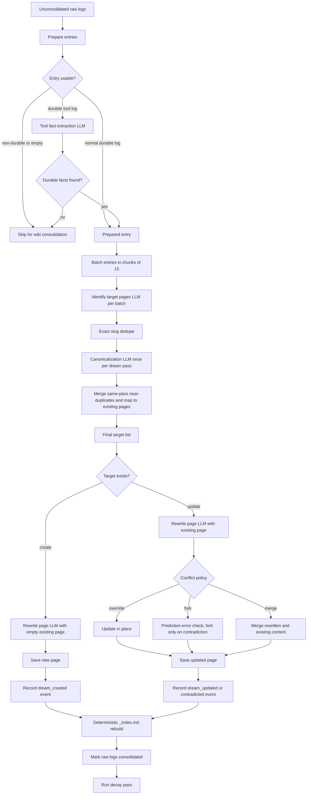

<p align="center">
  
</p>

# Mycelium

Mycelium is a local, plain-text memory system for LLM agents. It stores raw experience as episodic logs, consolidates useful knowledge into a Markdown wiki, and reloads relevant wiki pages into future chats.

The project includes a Python memory library, a FastAPI backend, and a React web UI for chatting with a local Ollama model and inspecting or operating on the memory store.

## Core Features

- **Plain-text memory store:** Wiki pages and episodic logs are Markdown files under `mycelium_store/`.
- **Multi-session chat UI:** Create, rename, resume, and continue multiple chat sessions without treating each individual message as a full session.
- **Long-term memory retrieval:** Each chat turn routes against the wiki index and loads relevant pages into the assistant's system context.
- **Episodic encoding:** Active chat episodes can be flushed into raw durable logs with structured LLM output.
- **Tool-aware chat:** The assistant can call Ollama `web_search` and `web_fetch`; tool calls are shown in the UI and stored as separate raw log entries using the truncated result seen by the model.
- **Dream consolidation:** Raw logs are consolidated into semantic wiki pages with source tracking and Obsidian-style `[[page-slug]]` cross-links.
- **Reconsolidation:** Retrieved pages can be flagged as labile when current context appears to contradict or extend them, then resolved into updated wiki pages.
- **Event-driven memory state:** Wiki pages track retrievability, stability, difficulty, access/reinforcement counts, and conservative archival state inspired by MemoryBank/FSRS.
- **Wiki editor:** Wiki pages can be viewed and manually edited from the web UI.
- **Log explorer:** Daily episodic log files can be inspected from the web UI.
- **Manual memory controls:** The UI can flush episodes, run dream, run decay, resolve reconsolidation, and clear memory for development.
- **Structured local LLM calls:** Memory operations use Ollama structured outputs with Pydantic schemas.

## Project Structure

```text
mycelium/
├── mycelium/           # Core memory library
│   ├── core.py         # Mycelium facade, retrieval, sessions, dream entrypoint
│   ├── encoder.py      # Transcript-to-log encoding
│   ├── dream.py        # Log-to-wiki consolidation
│   ├── reconsolidation.py
│   ├── decay.py
│   ├── ollama.py       # Internal adapter around the official Ollama SDK
│   ├── prompts.py
│   ├── store.py        # Markdown wiki/log persistence
│   └── structured_outputs.py
├── server/             # FastAPI backend
│   ├── main.py         # App setup and background scheduler
│   └── api/            # Sessions and memory API routers
├── ui/                 # React frontend (Vite + TypeScript + Tailwind)
│   └── src/components/ # Chat, Wiki, Logs, Sidebar controls
├── tests/              # Python test suite
├── examples/           # Library usage examples
├── mycelium.toml       # Local runtime configuration
├── start.sh            # Starts backend and frontend together
└── pyproject.toml      # Python package and uv configuration
```

## Quick Start

### Requirements

- Python 3.11+
- Node.js and npm
- [Ollama](https://ollama.com/) running locally
- A local model configured in `mycelium.toml` (currently `gemma4:latest`)

For web search and fetch tools, place an Ollama API key in the project-root `.env` file:

```bash
OLLAMA_API_KEY=your_api_key_here
```

### Install and Run

Install frontend dependencies once:

```bash
cd ui
npm install
cd ..
```

Start both the backend and frontend:

```bash
./start.sh
```

- Frontend: http://localhost:5173
- Backend API: http://localhost:8000

For access from another trusted device on your home network or Tailscale tailnet, open the frontend using the dev machine's LAN or Tailscale IP:

```text
http://<dev-machine-ip>:5173
```

The frontend derives the backend API origin from the hostname used to load the page, so `http://192.168.x.x:5173` calls `http://192.168.x.x:8000/api`, and `http://100.x.x.x:5173` does the same over Tailscale. You can override this with `VITE_API_ORIGIN` when starting the UI:

```bash
cd ui
VITE_API_ORIGIN=http://localhost:8000 npm run dev
```

Keep Ollama bound to localhost; the backend talks to it locally.

### WSL on Windows

If you run Mycelium inside WSL, use WSL mirrored networking so other devices can reach the WSL dev servers through the Windows LAN or Tailscale IP. In Windows, create or edit:

```text
C:\Users\<you>\.wslconfig
```

Add:

```ini
[wsl2]
networkingMode=mirrored
```

Then restart WSL from PowerShell:

```powershell
wsl --shutdown
```

Start Mycelium again with `./start.sh`, then open the Windows LAN or Tailscale IP from your phone:

```text
http://<windows-lan-or-tailscale-ip>:5173
```

If mirrored networking is not available or does not work on your Windows/WSL version, use the port-proxy fallback from an Administrator WSL terminal:

```bash
powershell.exe -ExecutionPolicy Bypass -File "$(wslpath -w scripts/Expose-MyceliumWsl.ps1)" -SetPrivateNetwork
```

You can also run the backend directly:

```bash
uv run python -m server.main
```

## Web UI

The web UI has three main tabs:

- **Chat:** Create and rename sessions, continue conversations, view loaded memory pages, and expand tool calls/results.
- **Wiki:** Browse semantic memory pages, inspect source log references and update history, and edit page content.
- **Logs:** Browse daily raw episodic log files.

The sidebar exposes manual memory operations:

- **Flush Current:** Encode the selected active chat episode into logs.
- **Flush Idle:** Encode episodes that have been idle or have grown large.
- **Flush All:** Force-encode every active episode.
- **Resolve Current:** Apply pending reconsolidation updates for the selected session.
- **Decay Pass:** Refresh wiki-page retrievability and archive weak, low-confidence memories.
- **Dream Pass:** Consolidate raw logs into wiki pages.
- **Clear Memory:** Development-only reset for wiki pages, logs, labile files, and encoded episode markers. Existing chat transcripts are preserved and made re-encodable.

Memory operation buttons show a spinner while a request is in progress and return the backend result in a browser alert.

## Memory Lifecycle

### 1. Chat and Retrieval

When a user sends a message, the backend builds a retrieval query from the chat title, recent thread context, and current message. The router LLM selects relevant wiki pages from the index. The routing context includes each page's confidence, importance, retrievability, and review timestamp so fresh stable memories are preferred without hiding older relevant pages. Loaded pages are added to the chat system prompt, marked as retrieved, and the full session transcript is passed to the chat model.

After the assistant responds, a small structured LLM call judges which loaded pages were actually used in the final answer. Pages judged as used receive a reinforcement event, increasing stability and resetting retrievability.

### 2. Tool Calls

Chat responses may use Ollama `web_search` and `web_fetch`. Tool calls are:

- executed inside the internal Ollama adapter,
- displayed in the chat UI with expandable arguments and results,
- persisted on the assistant message in session history,
- written immediately as separate raw log entries with the truncated result supplied to the model.

These tool logs are raw observations. They do not require an encoding LLM call; the dream cycle decides later whether they should affect wiki memory.

### 3. Episode Encoding

Chat sessions maintain an active episode buffer. Encoding happens when an episode is flushed:

- manually via **Flush Current** or **Flush All**,
- automatically for idle or large episodes,
- on backend shutdown with a forced flush.

The encoder sees the conversation transcript and extracts user-specific or interaction-specific facts into raw logs. It treats user messages as the primary source, uses assistant messages for context, and can capture personalized recommendations or plans without turning generic model knowledge into memory.

Encoded episode IDs are stored in `mycelium_store/sessions_meta.json`. This prevents already-flushed active episodes from being repeatedly encoded unless memory is cleared/reset.

### 4. Dream Consolidation

The dream process is the offline consolidation pass that turns durable raw logs into semantic wiki pages. It filters unsuitable logs, extracts durable facts from tool observations, batches target identification, canonicalizes proposed page targets to avoid near-duplicates, rewrites one page per final target, updates the deterministic wiki index, marks raw logs consolidated, and runs a decay pass.

Generated wiki content is intended to be Obsidian-compatible: cross-page references should use `[[page-slug]]`.



Key behavior:

- Tool observations are not consolidated directly. A tool-specific extraction prompt first keeps only source-grounded durable facts and discards page furniture, navigation text, ranking labels, and boilerplate.
- Target identification is batched by log entries, but canonicalization sees all proposed targets from the full dream pass at once. This prevents same-pass near-duplicates such as `llm-selection` and `local-llm-deployment` from becoming separate pages.
- Page rewrites happen once per final canonical target under the default `override` policy. `fork` and `merge` can add extra LLM calls for existing-page updates.
- Session-only and ephemeral logs are marked consolidated but do not become durable wiki pages.
- `_index.md` is generated deterministically from actual wiki pages rather than rewritten by the LLM.

### 5. Reconsolidation

When a wiki page is loaded into a chat, a prediction-error check can flag it as labile if the current context suggests it is outdated, incomplete, or contradicted. Reconsolidation signals are accumulated for the active episode and resolved either manually or during episode flush.

### 6. Memory State and Decay

Wiki pages use an event-driven memory state rather than a single decay score:

- `retrievability` is recomputed as `exp(-elapsed_days / stability_days)`.
- `stability_days` grows when a page is retrieved, used, dream-updated, or manually edited.
- `difficulty` rises when a page is contradicted and falls when it is reinforced.
- `created_at`, `last_accessed`, `last_reviewed`, review counts, reinforcement counts, conflict counts, and `pinned` are stored in page frontmatter.

The decay pass refreshes retrievability and archives only pages that are simultaneously low-retrievability, low-importance, low-confidence, not pinned, and not recently accessed. Raw episodic logs still carry a simple `decay_score` field for log-level bookkeeping.

## Background Automation

The FastAPI backend starts an APScheduler instance on startup:

- every 5 minutes: flush idle or large active episodes,
- every 30 minutes: run the dream process,
- every configured decay interval: refresh memory-state retrievability and archive weak pages,
- on shutdown: force-flush active episodes.

The web UI can also trigger the same memory operations manually.

## Storage Layout

The default store is `./mycelium_store`:

```text
mycelium_store/
├── sessions_meta.json  # Chat sessions, transcripts, active episodes, encoded episode markers
├── logs/               # Daily raw episodic logs
├── wiki/               # Semantic memory pages and _index.md
│   └── _archive/       # Archived wiki pages
└── labile/             # Pending reconsolidation drafts/signals
```

The memory store is meant to be readable and editable, but prefer the UI/API for normal wiki edits so version metadata and update logs stay consistent.

## Configuration

Runtime settings live in `mycelium.toml`:

```toml
[store]
path = "./mycelium_store"
git_commits = false

[llm]
model = "gemma4:latest"
url = "http://localhost:11434"
temperature = 0.2

[session]
context_budget_tokens = 8192
```

Additional defaults for reconsolidation, dream, and decay live in `mycelium/config.py`.

## Library Usage

```python
import asyncio
import mycelium

async def main():
    mem = mycelium.Mycelium(
        store_path="./agent_memory",
        ollama_model="gemma4:latest",
    )

    query = "What do we know about the project architecture?"
    async with mem.session(query=query) as session:
        prompt = session.build_prompt(query)

        # Run your agent with the memory-informed prompt.
        response = "The project uses a plain-text wiki pattern."

        session.record("user", query)
        session.record("assistant", response)

    await mem.dream()

if __name__ == "__main__":
    asyncio.run(main())
```

The web app uses a more persistent session model in `server/runtime.py`, while the library session context manager remains useful for direct integrations.

## Development

Run backend tests:

```bash
uv run pytest
```

Build the frontend:

```bash
cd ui
npm run build
```

The UI supports Markdown, GitHub-flavored Markdown tables/lists, and KaTeX-rendered LaTeX such as `$\\theta$` and `$$\\theta_{t+1} = \\theta_t - \\alpha \\nabla L$$`.

## Current Notes

- The web app owns long-lived chat sessions and scheduled flushing. The direct library session context manager still encodes on context exit.
- Tool observations are logged immediately, while ordinary chat content is logged only when an episode is flushed.
- Wiki memory state is event-driven. Retrieval, answer usage, dream creation/update, contradiction, and manual edits all update page metadata.
- Git commit integration exists in configuration/model fields but is not a primary UI workflow.
