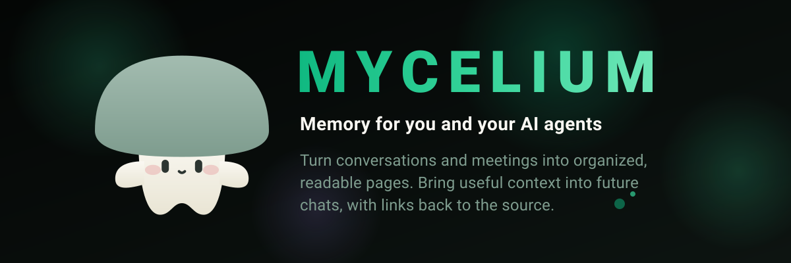

<p align="center">
  
</p>

# Mycelium

Mycelium is a plaintext memory system for local AI agents. It keeps the original conversation as a durable record, turns useful information into an organized Markdown wiki, and brings the relevant parts back when they are needed later.

It is designed for users who want a local assistant that can build context over time without hiding its memory in an opaque database. You can chat with it through the included web app, inspect the complete evidence-to-claim pipeline, review proposed memory updates, or add the Python library to another agent.

## Why use it?

Most chat assistants either forget everything between sessions or require the entire conversation history to be sent again. Mycelium takes a different approach:

- **Memory persists across conversations.** Projects, preferences, decisions, research, and prior discussions can carry into a new session.
- **Everything stays inspectable.** Raw experiences and generated wiki views are Markdown; source documents, episode manifests, claims, and audits are JSON.
- **Local models do the work.** Chat, retrieval, and memory consolidation run through Ollama on your machine.
- **You stay in control.** The UI shows the memories used for a response and requires review before contradictions or replacements change canonical claims.

## Features

- Multi-session chat with a local Ollama model
- Hybrid automatic retrieval plus assistant-directed follow-up memory search
- Durable short-term memory that is retrievable before wiki consolidation
- Plain-text episodic logs and an Obsidian-compatible Markdown wiki
- Evidence-triggered, claim-level reconsolidation with human review
- Deterministic, read-only wiki projections with exact source provenance
- Meeting ingestion pipeline - upload meeting audio to have it transcribed, diarized, and consolidated into the memory system
- A Python API for adding Mycelium memory to other agents and frameworks

## Quick start

### Requirements

- Python 3.11 or newer
- [uv](https://docs.astral.sh/uv/)
- Node.js and npm
- [Ollama](https://ollama.com/) running locally

Clone and install dependencies:

```bash
git clone https://github.com/nsadras/mycelium.git
cd mycelium
uv sync
cd ui
npm install
cd ..
```

Mycelium is currently configured to use `gemma4:12b` for language tasks and
`embeddinggemma` for memory retrieval. Download both models with Ollama, or
change them in `mycelium.toml`:

```bash
ollama pull gemma4:12b
ollama pull embeddinggemma
```

With Ollama running, start the backend and frontend together:

```bash
./start.sh
```

Open [http://localhost:5173](http://localhost:5173) to use the app. The FastAPI backend is available at [http://localhost:8000](http://localhost:8000).


## Using the app

The UI is organized around five main areas:

| Area | What it is for |
| --- | --- |
| **Chat** | Create, rename, resume, and continue conversations. Each answer can show which memory pages were loaded and which tools were called. |
| **Memory** | Inspect sources, segments, claims, Dream audits, and pending reconciliation proposals. |
| **Wiki** | Browse and curate entity-owned views deterministically generated from canonical claims. |
| **Logs** | Inspect the original episodic records that serve as source evidence for the wiki. |
| **Engram** | Upload meeting audio, review the transcript and speakers, then save the finished meeting into memory. |

A typical workflow is simple:

1. Start a chat and use the assistant normally.
2. Use **Flush Current**, **Flush Idle**, or **Flush All** when you want chat episodes encoded into
   source-grounded claims and inspectable short-term memory.
3. Run **Dream Pass** when you want to consolidate pending claims and review deferred memory.
4. Start another chat about the same subject. Mycelium supplies a compact initial set of source-grounded claims, and
   the assistant can search memory again or inspect exact sources when the question needs more evidence.
5. Open **Memory** to trace what was remembered and approve or reject proposed contradictions and replacements.

The sidebar provides manual controls for flushing episodes, running Dream, and clearing the development
store. The server does not schedule memory work in the background. **Flush Idle** checks idle and episode-size
conditions only when selected; elapsed time and queue thresholds do not trigger work by themselves.

### How memory works

Flushing a conversation preserves the original transcript and extracts source-linked claims into inspectable
short-term memory. Running Dream organizes useful claims into the Markdown wiki. Both operations happen only when
you request them through the UI or API.

The wiki distinguishes people, organizations, ongoing projects, recurring series, individual events, artifacts,
places, and abstract topics. A meeting, tool, or deliverable can remain part of its larger context without creating
an unnecessary standalone page. Responsibilities shared between a person and a project appear on both pages while
remaining one source-backed memory.

Every wiki fact links back to its source. When new information conflicts with existing memory, Mycelium creates a
review proposal instead of silently overwriting either version. The Memory and Wiki views let you inspect evidence,
correct organization, merge duplicate subjects, and approve or reject proposed changes.

For the detailed lifecycle, entity model, retrieval design, and validation rules, see [DESIGN.md](DESIGN.md).

### Web search

To let the chat assistant use Ollama's web search and fetch tools, add an Ollama API key to a `.env` file in the project root:

```bash
OLLAMA_API_KEY=your_api_key_here
```

Tool calls and the result seen by the model are visible in the chat and retained as source observations for later consolidation.

### Meeting memory with Engram

Engram is optional. Install its speech-processing dependencies separately:

```bash
uv sync --group engram
```

For speaker diarization, accept the terms for `pyannote/speaker-diarization-community-1` on Hugging Face and provide a token:

```bash
export HF_TOKEN=your_hugging_face_token
```

Upload a recording from the **Engram** tab, click **Process**, review the generated transcript and speaker labels, then finalize it. Mycelium saves the transcript and structured meeting summary into the same memory system used by chat.

GPU acceleration is detected automatically when available. See [DESIGN.md](DESIGN.md#engram-meeting-pipeline) for model, device, and testing options.

## Use Mycelium as a library

The web app is optional. The Python API exposes the same three-stage lifecycle used by the server:

| Operation | Input | Output |
| --- | --- | --- |
| `ingest_source` | `SourceInput` with a transcript, source kind, participants, segments, and idempotency key | `IngestionResult` with the created log, source, episode, claim, and operation IDs |
| `retrieve_context` | `RetrievalRequest` with a query and context budget | `RetrievalResult` with inspectable pages, typed evidence records and sources, authoritative Markdown/pseudo-XML rendering, and a retrieval trace |
| `consolidate` | `ConsolidationRequest` with dry-run and deferred-claim policy | `ConsolidationResult` with the Dream report and retried extraction IDs |

For an ordinary agent turn, retrieve memory before generation and ingest the completed exchange afterward:

```python
import asyncio

import mycelium


async def main():
    memory = mycelium.Mycelium(
        store_path="./agent_memory",
        ollama_model="gemma4:12b",
    )

    question = "What did we decide about the project architecture?"
    retrieval = await memory.retrieve_context(
        mycelium.RetrievalRequest(query=question)
    )

    # Supply retrieval.rendered_context as runtime evidence alongside the
    # question. Keep behavioral instructions in the model's system prompt.
    answer = "We chose a plain-text wiki backed by source logs."

    await memory.ingest_source(mycelium.SourceInput(
        transcript=f"USER: {question}\nASSISTANT: {answer}",
        session_id="architecture-chat",
        idempotency_key="architecture-chat:1",
    ))
    consolidation = await memory.consolidate(
        mycelium.ConsolidationRequest()
    )
    print(consolidation.report)


if __name__ == "__main__":
    asyncio.run(main())
```

`Mycelium.session()` remains an ergonomic wrapper around retrieval and ingestion for conversational agents. Web and
library integrations use the same budgeted memory-context renderer. `consolidate_if_ready()` applies the configured
queue policy when the caller wants conditional consolidation. See
[`examples/basic_session.py`](examples/basic_session.py) for a runnable example and
[`examples/langgraph_integration.py`](examples/langgraph_integration.py) for a LangGraph integration pattern.

## Configuration

The main settings live in `mycelium.toml`:

```toml
[store]
path = "./mycelium_store"

[llm]
model = "gemma4:12b"
url = "http://localhost:11434"
context_window_tokens = 32768

[session]
context_budget_tokens = 32768

[retrieval]
embedding_model = "embeddinggemma:latest"
candidate_limit = 20
initial_result_limit = 5
tool_result_limit = 6
tool_search_limit = 3
tool_evidence_budget_tokens = 6000

[dream]
queue_claim_threshold = 20
max_pending_hours = 24
deferred_revisit_hours = 168
```

The default memory store is `./mycelium_store`. It consists primarily of Markdown and JSON, so it can be
inspected with ordinary text tools or opened as a wiki outside the app. Every saved chat message carries its own
timestamp, allowing one conversation to span multiple days without losing temporal context.
`session.context_budget_tokens` is the total input budget shared by the assistant system prompt, recent transcript,
initial memory, and follow-up memory evidence; it is capped by `llm.context_window_tokens`. Retrieval tool limits are
per assistant response.

Architecture, storage contracts, retrieval details, migrations, development checks, and benchmark workflows are
documented in [DESIGN.md](DESIGN.md). The Daily Driver fixture has its own
[benchmark guide](benchmarks/fixtures/daily_driver_v1/README.md).

## License

Mycelium is available under the MIT License. See [LICENSE](LICENSE).
