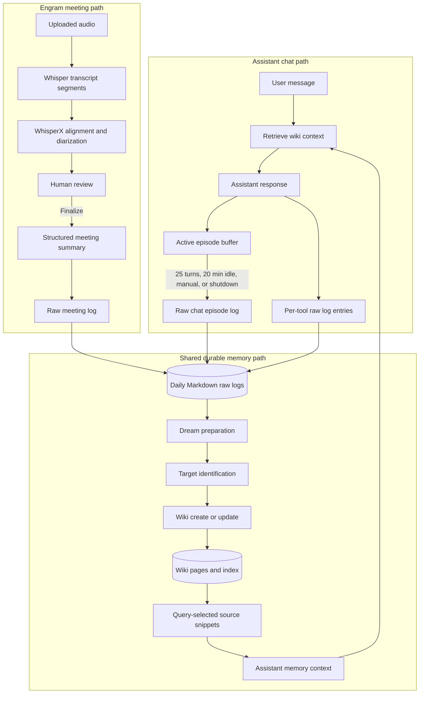
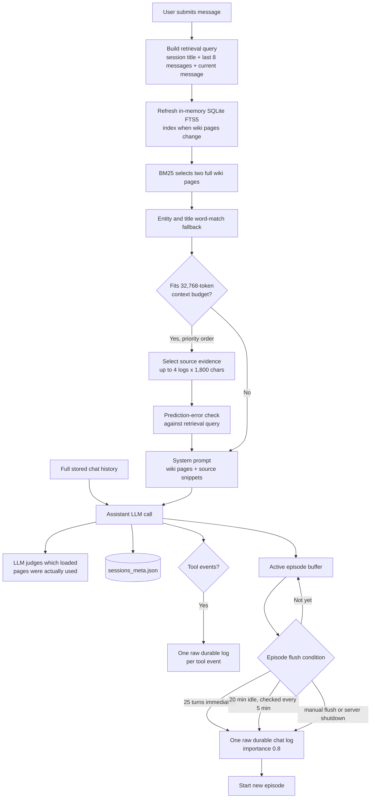
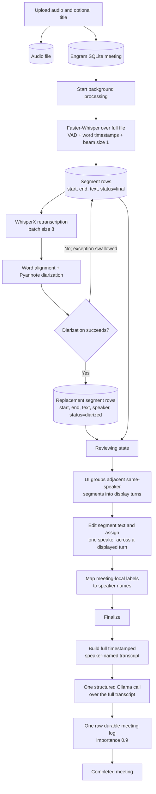
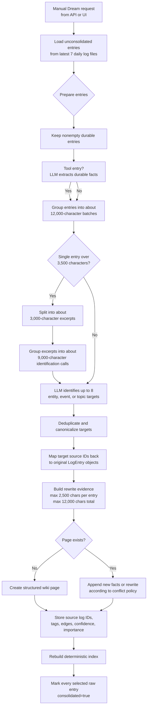
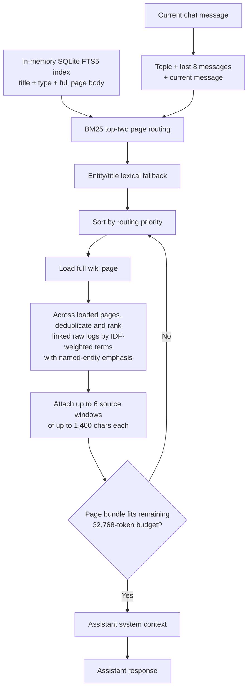
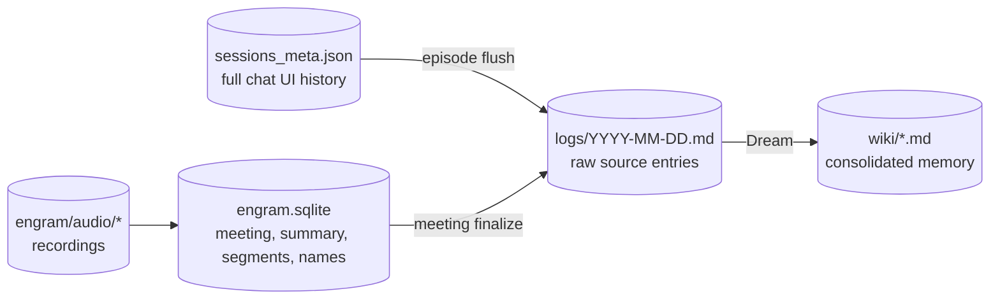

# Mycelium Information Flow — Historical Snapshot

> **Status:** Superseded. This document records the implementation as inspected on 2026-08-11 and includes
> mechanisms that have since been replaced. `DESIGN.md` is the authority for the current production
> architecture; `planning/mycelium-audit-2026-08-13.md` records the transition and remaining roadmap.

This document describes the implementation snapshot of assistant-chat and Engram meeting ingestion, shared
Dream consolidation, retrieval, and retention as of 2026-08-11. Limits below are historical implementation
values, not current guarantees or proposed targets.

## System Overview

The two input paths converge only after they become `LogEntry` objects. From that point, Dream does not have a structured source-type field; it distinguishes sources only through entry IDs and prose embedded in entry content.

## Assistant Chat Flow

### Chat retention and batching

| Stage | Retained | Not carried forward |
|---|---|---|
| Session metadata | Full user/assistant transcript; loaded-page metadata and tool events attached to assistant messages; active and encoded episode metadata | Memory-usage judgment returned to the client is not added to the transcript |
| Retrieval query | Session title, current user message, and last 8 transcript messages | Earlier thread messages are not used to choose wiki pages, although they are still sent as chat history |
| Assistant prompt | Full chat history plus selected wiki page content, recall sections, and source snippets | Pages that fail routing or the context budget |
| Episode buffer | User and assistant role/content; assistant records also contain loaded-page and tool-event metadata | When formatted for raw memory, only role and content are emitted |
| Raw chat log | One canonical `USER:` / `ASSISTANT:` transcript per episode; timestamp; episode ID; importance `0.8`; durable/raw/unconsolidated state | Loaded-page metadata, retrieval decisions, page-usage judgment, and structured tool events |
| Raw tool log | Tool name, arguments, result, success/failure, truncation flag, chat session, episode, and turn number; importance `0.5` | Tool result content already truncated upstream cannot be recovered |

### Chat episode boundaries

- A chat request automatically flushes after the active episode reaches **25 user turns**.
- A scheduler runs every **5 minutes** and flushes buffers idle for **20 minutes** or at least 25 turns.
- Manual flush, flush-all, and server shutdown can force an episode boundary.
- Flushing creates a new episode ID and resolves in-memory reconsolidation signals for the old episode.
- The full UI transcript remains in `sessions_meta.json`; episode flushing does not remove it.

## Meeting Transcript Flow

### Meeting retention and batching

| Stage | Retained | Not retained or transformed |
|---|---|---|
| Upload | Audio bytes on disk; title; upload-time start/end timestamps; measured duration; audio path | Original file name is not stored as meeting metadata; timestamps represent ingestion, not necessarily when the meeting occurred |
| Faster-Whisper | Segment start/end and text | Word-level timestamps requested from Whisper are not stored |
| WhisperX | A second transcription, aligned segment times, diarization labels | The initial Faster-Whisper segment set is replaced when diarization succeeds |
| Diarization failure | Initial transcription remains and processing still advances to review | Diarization error details are swallowed; speaker attribution is absent |
| Review | Corrected per-segment text; reassigned meeting-local speaker label; speaker-name mapping | Adjacent-segment grouping is presentation-only and is recomputed from stored segments |
| Summary | Summary, decisions, action items, and open questions in Engram SQLite | Token-aware transcript batches are summarized and recursively reduced; no transcript prefix is discarded |
| Raw meeting log | Metadata, structured summary JSON, and complete timestamped speaker-named transcript; meeting session ID; importance `0.9`; durable/raw/unconsolidated state | No structured source type or participant IDs on `LogEntry`; audio is referenced by path rather than embedded |
| Completion | Engram meeting links to the raw memory log ID | Later speaker-name changes do not rewrite the finalized raw log or derived wiki pages |

There is no meeting-level batching before raw-memory ingestion: one finalized meeting always becomes one raw log entry, regardless of transcript length.

## Shared Dream Consolidation

### Dream batching details

| Boundary | Current value | Consequence |
|---|---:|---|
| Raw-log discovery | Latest 7 daily Markdown files | Older unconsolidated entries are not selected by the normal Dream run |
| Initial entry grouping | About 12,000 characters | Multiple raw chat episodes, meetings, and tool logs may share one target-identification call |
| Long-entry threshold | 3,500 characters | A single long chat episode or meeting is split for target identification |
| Identification excerpt | About 3,000 characters | All excerpts keep the same original log entry ID |
| Long-entry identification batch | About 9,000 characters | Several excerpts can share an identification call |
| Targets | At most 8 per identification response | Long inputs can produce more overall because they use several calls; targets are later deduplicated |
| Page rewrite evidence | 2,500 characters per original entry | After a late-meeting target is identified from an excerpt, rewriting maps back to the original entry and usually sees only its beginning |
| Total evidence per page update | 12,000 characters | Later relevant entries can be omitted when several sources target the same page |
| Existing-page update | Default conflict policy is override with additive append first | If no facts append, the process may fall back to a full rewrite |

### What Dream retains

- Focused entity, event, and topic wiki pages.
- Wiki content, tags, related-page edges, confidence, importance, and version history.
- A page-level list of contributing raw log entry IDs.
- Source-log backlinks written into page Markdown when the LLM follows the prompt.
- Raw logs themselves remain in daily Markdown files after `consolidated` changes to `true`.

### What Dream does not structurally retain

- Source type (`chat`, `meeting`, `tool`, or manual) as a `LogEntry` field.
- Per-fact source, speaker, segment, or transcript offsets.
- Whether a statement was a claim, proposal, disagreement, decision, or commitment.
- A formal distinction between primary transcript evidence and its generated summary.
- Participant identities that persist across meetings.
- Access-control, confidentiality, consent, or retention scope.

Dream marks all raw entries selected at the start of the run as consolidated after processing. This includes entries that produced no target or whose target rewrite failed, so `consolidated=true` means "the run considered this entry," not "all durable facts were successfully preserved in the wiki."

## Retrieval Back Into Chat

Raw logs are not searched globally during normal chat retrieval. They can appear only as source snippets after a wiki page has been selected and that page already links to the raw log. Therefore, a finalized meeting is not normally available to chat until Dream has created or updated at least one wiki page from it.

The page index is a lazily refreshed, in-memory SQLite FTS5 projection. It indexes each non-derived wiki
page as one coherent row, uses Porter stemming, weights the title more strongly than the body, and returns
the two best BM25 pages without an LLM call. Explicit entity/title token matches may add non-derived pages
after those two lexical candidates. Selected pages are rendered only once in assistant context.

Nested headings under `## Key Facts`, `## Event Timeline`, and `## Source Logs` remain part of their parent
page. Source windows are ranked globally across the selected pages' unique backlinks; the ranker favors rare
query terms while preserving extra weight for named entities.

## Storage and Deletion Boundaries

- Deleting an Engram meeting currently removes its SQLite meeting/segments and audio file.
- It does **not** delete the finalized raw meeting log.
- It does **not** retract facts from wiki pages that cite that log.
- Deleting or renaming a chat session is separate from its already-flushed raw logs and derived wiki pages.
- There is no source-retraction or derived-memory rebuild path today.

## Highest-Impact Decision Points

1. **Long-source handling (implemented):** Stable evidence chunks now remain addressable through identification and page rewriting, with token-aware batching instead of prefix truncation.
2. **Evidence model:** Add source type, participant identity, exact segment provenance, and primary-versus-derived status.
3. **Semantic extraction:** Represent claims, proposals, decisions, commitments, disagreements, and questions before wiki consolidation.
4. **Retraction:** Define deletion as a graph operation covering source logs and wiki facts, not only the original chat or meeting record.
5. **Retrieval scope:** Decide whether meeting-derived memory is globally available or filtered by project, participant, confidentiality, or collection.
6. **Processing guarantees (partially implemented):** Dream reports completed and pending source IDs plus stage failures; failed connected source/page groups are not persisted or marked consolidated.
